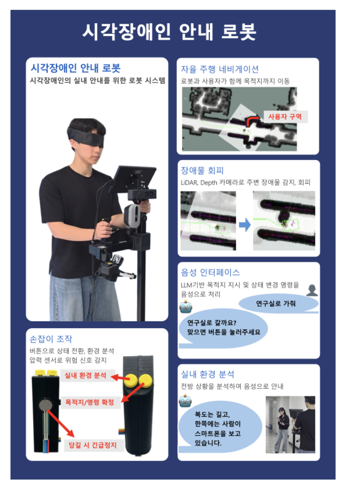
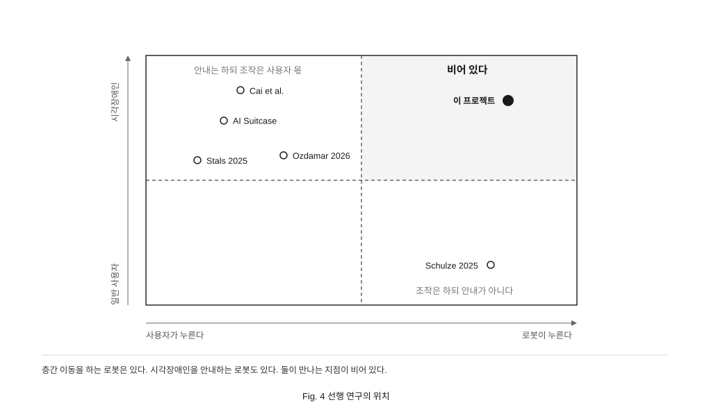
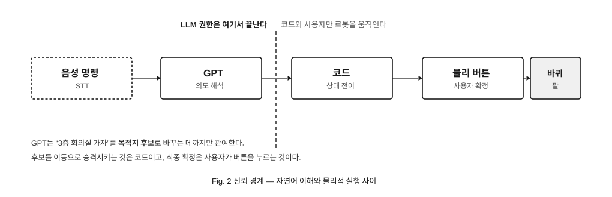
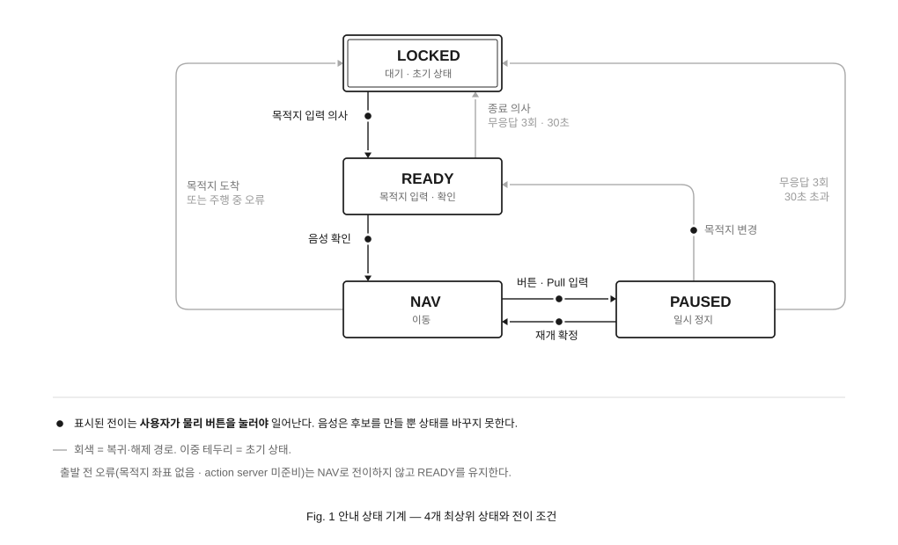
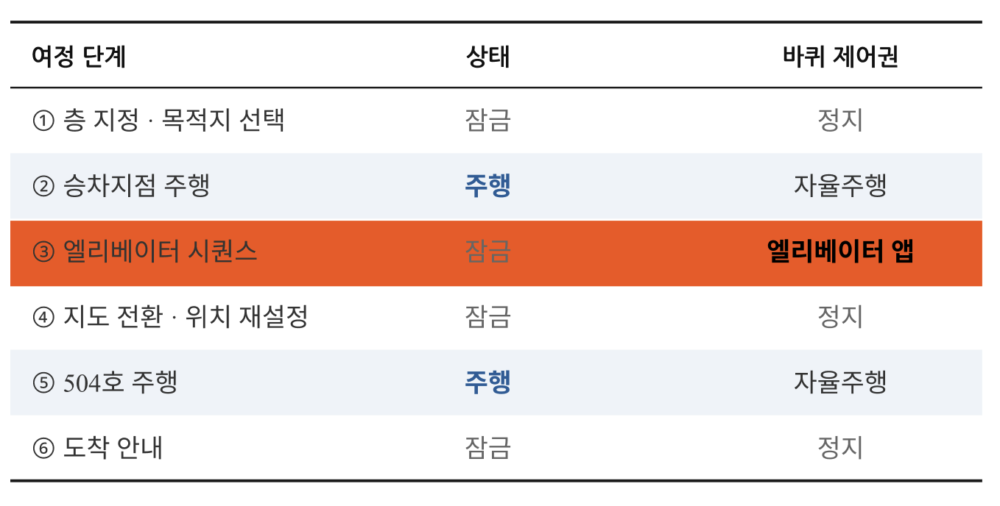
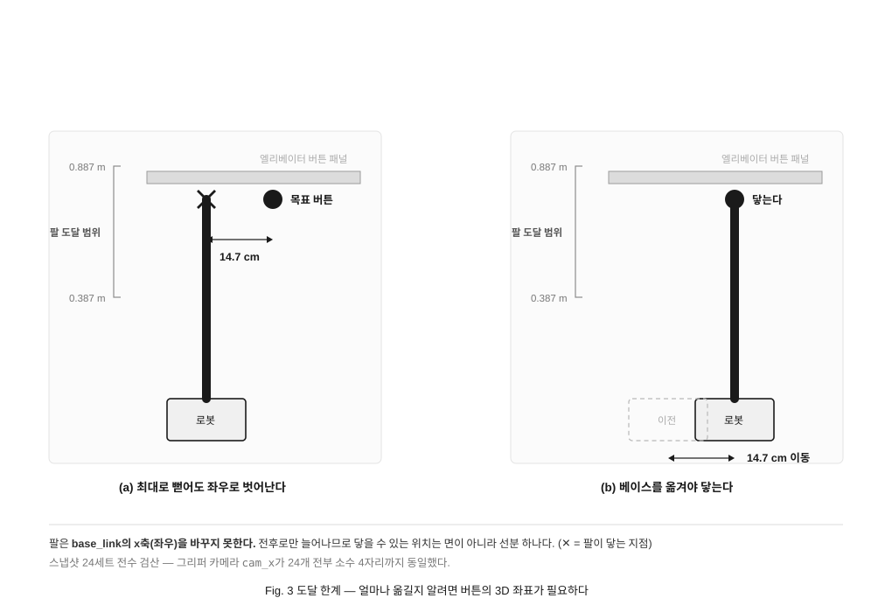
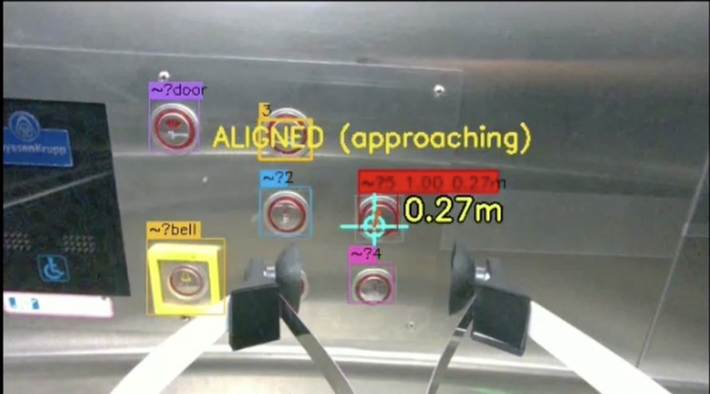

<div align="center">

# 시각장애인 실내 안내 로봇

**상용 로봇 플랫폼 위에, 엘리베이터를 스스로 타고 층을 넘어가는 안내 시스템을 소프트웨어로 구현한다**

[](https://docs.ros.org/en/humble/)
[](https://navigation.ros.org/)
[](https://hello-robot.com/)
[](https://docs.ultralytics.com/)
[]()

단국대학교 배리어프리 ICT기술 연구센터(ITRC) 과제 · 단독 개발 · 2025.12 ~ 진행 중

</div>

<div align="center">

<br><sub>ITRC 인재양성대전(코엑스) 전시 포스터. 안대를 착용한 사용자가 손잡이를 잡고 로봇을 따라간다</sub>
</div>

<div align="center">

### 데모 영상

<a href="https://www.youtube.com/watch?v=3vwIzmuHD_s">

</a>
<a href="https://www.youtube.com/watch?v=SAGndz1JyPY">

</a>

<sub>왼쪽 — **1층 → 엘리베이터 자율 탑승 → 5층 504호** 전 구간 (1회) &nbsp;·&nbsp; 오른쪽 — 코엑스 시연</sub>

</div>

---

## 한눈에 보기

| | |
|---|---|
| **문제** | 시각장애인 실내 이동에서 가장 막히는 건 **층간 이동**이다 |
| **왜 어려운가** | 로봇–엘리베이터는 **제조사·연도마다 제어 방식이 달라 표준 API가 없다** |
| **해결** | 프로토콜 대신 **그리퍼 카메라로 버튼을 직접 인식·가압**한다 |
| **성과** | **1층 → 5층 end-to-end 완주**(1회) · ITRC 인재양성대전(코엑스) 시연 |
| **원칙** | 사용자는 실패를 볼 수 없다 → **LLM은 의도 해석만, 최종 확정은 물리 버튼** |

---

## 1. 선행 연구의 빈 칸

층간 이동을 하는 로봇은 있다. 시각장애인을 안내하는 로봇도 있다. **둘이 만나는 지점이 비어 있다.**

<div align="center">

</div>

| 선행 연구 | 다층 | 시각장애인 | 로봇이 가압 |
|---|:---:|:---:|:---:|
| Schulze 2025, *Front. Robot. AI* | ✅ | ❌ | ✅ |
| Takagi 2025 — AI Suitcase (IBM·CMU) | 부분 | ✅ | ❌ |
| Cai et al. — *Navigation beyond Wayfinding* | ✅ | ✅ | ❌ |
| Ozdamar 2026, *IJRR* | ❌ | ✅ | ❌ |
| Stals 2025, *HRI* | ❌ | ✅ | ❌ |
| **이 프로젝트** | ✅ | ✅ | ✅ |

**버튼을 못 보는 사람에게 "앞까지 데려다 줄 테니 누르세요"는 문제를 옮긴 것이다.**
대상의 특성이 곧 기술적 제약이 된다.

---

## 2. 당사자 인터뷰

| 초기 아이디어 | 당사자 반응 | 결정 |
|---|---|---|
| 엘리베이터 층간 이동 | 조건부 — 터치 패널은 스트레스 | 채택 |
| 흐름 기반 안내 | 긍정 — *"남과 부딪혀 항의받은 경험이 있다"* | 채택 |
| 장애물 밀고 가기 | 반대 — *"밀린 물건이 발에 걸릴 수 있다"* | **폐기** |

밀기는 프로토타입까지 만든 뒤 뺐다.
사용자는 안내자의 한 발 뒤에 선다 — **밀린 물건이 향하는 곳이 사용자의 발밑이다.**

---

## 3. 볼 수 없는 사용자

> [!IMPORTANT]
> **사용자는 로봇의 실패를 볼 수 없다.** 화면 에러는 이 시스템에서 무의미하다.

### 3-1. 신뢰 경계

<div align="center">

</div>

LLM이 오해석해도 로봇은 움직이지 않는다. 그 사이에 사람이 누르는 버튼 하나가 있다.

### 3-2. 상태 4개

<div align="center">

</div>

세분이 필요하면 상태를 늘리지 않고 `READY_DEST_INPUT` · `READY_CONFIRM` 같은 하위 국면으로 내렸다.
**전이 규칙이 코드 한 곳에서 다 읽혀야 하기 때문**이다.

### 3-3. 제어권

<div align="center">

</div>

주행은 Nav2, 캐빈 안은 버튼 앱, 나머지는 **잠금.** 둘이 동시에 살아 있으면 로봇을 같이 움직인다 —
사람이 뒤에서 손잡이를 잡고 있으면 그대로 물리 사고다.

### 3-4. 조용한 실패

| # | 사용자가 겪는 증상 | 심각도 |
|---|---|---|
| L | 다른 층을 말했는데 현재 층 같은 자리에서 "도착했습니다" | 🔴 |
| 3 | 여정을 취소했는데 엘베 앞으로 56.5 cm 전진 + 90° 회전 | 🔴 |
| 2 | 손잡이를 당겨 일시정지했는데 계속 감 | 🔴 |
| 6 | 지도 전환 실패해도 진행 → 4층인데 5층 지도로 주행 | 🔴 |

**결함 27건**을 두 규칙으로 기록한다 — **확증과 정황을 섞지 않는다**,
**증상을 사용자 관점으로 쓴다.** 

---

## 4. 엘리베이터 자율 탑승

### 4-1. 표준 API 부재

제조사마다, 같은 제조사라도 **제작 연도마다 제어 방식이 다르다.** 탑승 안전 국가표준(KS)은 제정 중이다.
그래서 프로토콜에 의존하지 않는다 — **눈으로 보고 손으로 누른다.**

### 4-2. 층 전환

버튼을 누르는 것만큼 어려운 게 층이 바뀐 뒤다. **로봇은 자기가 몇 층인지 모른다.**

`load_map`으로 재시작 없이 지도를 `floor3` → `floor4`로 바꾼다. 문제는 그다음이다 —
AMCL은 여전히 이전 층 위치를 믿고 있어서, 하차지점 좌표로 `initialpose`를 자동 발행해 재측위한다.
**실패하면 4층인데 3층 지도로 주행한다. 아무 에러도 안 뜬다**(결함 #6).

### 4-3. 하드코딩된 배치도

```python
# elevator_button_press/main.py:206
_layout_rows = [["문열림", "3", ""], ["", "2", "5"], ["종", "1", "4"]]
```

`button_layout.json`이 없으면 **조용히 이 값으로 폴백한다.** 엘리베이터가 바뀌면 사람이 다시 적어 줘야 한다.
런타임 입력에서 걷어내고 **채점 기준표로만 남겼다.**

### 4-4. 도달 한계 — 인식이 아니었다

정답지를 걷어내도 아래쪽 버튼이 안 눌렸다. 원인은 인식이 아니었다.
Stretch의 팔은 **좌우로 움직이지 못한다.**
스냅샷 24세트 전수 검산 — `cam_x`가 **전부 소수 4자리까지 동일**.

<div align="center">

</div>

OCR-RCNN에는 깊이가 없다. **인식 정확도를 올려도 안 풀린다.**

### 4-5. 사진으로 좌표 복원

사진 + 카메라 파라미터 + 물리 통념(버튼 지름 15~55 mm)만으로 버튼 7개의 3D 좌표·번호를 복원한다.
검증은 **촬영일·자세·거리·코드가 전부 다른 독립 3측정 교차대조.**

| | 8/31 · 180736 | 8/31 · 180746 | 9/2 · 183106 |
|---|---|---|---|
| 촬영 거리 | 0.621 m | 0.621 m | **0.477 m** |
| 격자 · 채움 | 3×3 · `[●●·][·●●][●●●]` | 동일 | **동일** |
| 행 간격 | 62.6 / 53.5 mm | 58.9 / 57.6 mm | 60.6 / 56.8 mm |
| 열 간격 | 81.9 / 66.6 mm | 79.2 / 68.5 mm | 77.1 / 67.6 mm |
| 평면 잔차 rms | 1.25 mm | 2.10 mm | 2.68 mm |

**여섯 개 간격 전부가 4.8 mm 안에서 일치했다.**

<div align="center">

<br><sub>목표 버튼(0.27 m) 정렬 완료. 못 읽은 버튼은 <code>~?</code>로 두고 배치 패턴으로 추정한다</sub>
</div>

### 4-6. 좌표 기반 정렬

*(5-3 완주 이후 작업. 완주 당시엔 아래 옛 방식을 썼다.)*

| | 전 | 후 |
|---|---|---|
| 방식 | 하드코딩 거리 전진 + 회전 | 좌표 기반 3단 정렬 ×4회 |
| 횡오차 | 4.53° 어긋남 → **16.3 cm** (문틀 충돌 범위) | 잔여 1 cm · 3° |
| 패널까지 | 0.827 m | **0.696 m** |
| 팔 여유 | 6 cm | **19 cm** |

> [!WARNING]
> **미검증** — 시뮬레이션 50회 기준 중앙값이다. 실기체 검증은 6장에 있다.

---

## 5. 통합

개별 모듈이 도는 것과 여섯 단계를 한 번에 통과하는 건 다른 문제였다.

### 5-1. 사회적 규범 주행

`people_tracker`가 사람을 **접근자 · 동행자 · 정지**로 분류해 경유지에 반영한다(YOLOv8n + ByteTrack).

Nav2는 로봇만 보고 경로를 짠다. **로봇이 지나갈 수 있는 틈에서 뒤따르는 사람은 벽에 부딪힌다.**

| 항목 | 값 | 이유 |
|---|---|---|
| **footprint** | **5각형, 뒤 −0.85 m** | **뒤에 선 사람을 로봇의 몸에 포함** |
| **min_vel_x** | **0.0** | 후진 차단 |
| inflation_radius | 0.45 m | 벽에서 45 cm |
| cost_scaling_factor | 2.5 | 복도 중앙 유도 |

**"사람이 뒤에 있다"를 알고리즘이 아니라 파라미터로 표현**했다.

> [!WARNING]
> **미검증** — 설계값이다. 근접 이벤트가 실제로 줄었는지는 측정하지 않았다.

### 5-2. CPU 병목

주행 중 로봇이 간헐적으로 멈췄다. 눈으로는 그냥 멈칫할 뿐이었다.

**원인을 찾기 전에 볼 수 있는 장치부터 만들었다.** 기존 블랙박스는 대시보드에 얹혀 있어 같이 죽었다(실측 49분 침묵).
독립 프로세스로 분리했다.

| | 1차 | 2차 |
|---|---|---|
| 증상 | 5초마다 멈춤 | 그래도 남은 멈춤 6회 |
| 결정적 로그 | costmap 드롭 **838회** (엘베 OFF면 0회) | **`Control loop missed its desired rate` 33회** |
| 원인 | 주행과 엘베 앱 동시 구동 | `vision_assistant` 상시 CPU **43%** |
| 조치 | 토글로 순차 전환 (운영 방식) | 매 프레임 JPEG 인코딩 → 요청 시 (`0ad773d`) |
| 결과 | 드롭 0 · 정상 도착 | **idle 43% → 약 0%** (멈춤 감소는 미측정) |

**오진도 남겼다.** 이날 세 번 헛짚었다 — "RViz가 라이다를 죽인다", "그리퍼 카메라가 얼었다",
"중복 nav 스택". 전부 틀렸다. 교훈은 한 줄 — **노이즈 측정으로 결론 내기 전에 검증한다.**

### 5-3. 1층 → 5층

**CPU를 비운 그날, 여섯 단계가 처음으로 한 번에 이어졌다.**

2026년 8월 13일 — 호출 가압 · 문 앞 정렬 · 문 열림 대기 · 탑승 · 층 가압 · 하차.
사람의 개입 없이 **1층에서 5층 504호까지** 갔다.

**그리고 이것이 1회다.** 같은 날 두 가지가 안 됐다.

- **올라가는 것만 됐다** — 호출 버튼 ▲/▼ 중 하나만 인식됐다
- **탑승 실패가 잦았다** — 문 열린 뒤 전진 185 cm를 닫히기 전에 못 끝냈다


---

---

## 6. 한계

| 한계 | 왜 남아 있나 | 다음 |
|---|---|---|
| **정상 시나리오 1회.** 반복 성공률 미측정 | 통합 완주가 최근이고 세션마다 환경이 다르다 | 단계별 성공률 측정 |
| **내려가는 시나리오를 못 돈다** | 호출 버튼 ▲/▼ 중 하나만 인식된다 | 앵커 로직에서 ▲▼ 구분 |
| **탑승이 문 닫힘 시간을 못 맞춘다** | 전진 185 cm를 제한 시간에 못 끝낸다 | 속도·타이밍 조정 |
| **좌표 기반 정렬 실기체 미검증** | 시뮬·정지 계산까지만 | odom·AMCL 동시 로깅 |

<details>
<summary><b>그 외 한계 5개</b></summary>

| 한계 | 왜 남아 있나 | 다음 |
|---|---|---|
| 버튼 매핑이 오프라인에 머문다 | 손끝 TF가 없고, 위치제어 팔이 **막혀도 도달했다고 보고**한다 | TF 추가 · 버튼 점등으로 접촉 판정 |
| 깊이 스케일 +6% 미해소 | 깊이 단위와 리프트 기구학 오차가 축퇴 | 알려진 치수 물체 촬영 |
| CPU 최적화 효과 미측정 | idle은 확인, 멈춤 감소는 미확인 | patience 초과 전후 대조 |
| 사회적 규범 주행 효과 미검증 | 파라미터 설계까지만 | 근접 이벤트 감소 측정 |
| 터치 패널 미대응 | 물리 가압의 원리적 한계 | 연동형 병행 검토 |

</details>

**한 번 이어진 것을 여러 번 이어지게 만들고, 시뮬에서 맞춘 것을 실기체에서 확인하는 것**이 다음이다.

---

## 문서

| | |
|---|---|
| [실행 매뉴얼 (RUNBOOK)](docs/RUNBOOK.md) | 모든 실행 명령어 · 설정 파일 · 자주 겪는 문제 |
| [하드웨어 사양](docs/HARDWARE.md) | 카메라 시리얼 고정 · 물리 제약 |
| [Navigation & SLAM 가이드](navigation-and-slam-guide.md) | 맵핑 재현 절차 |
| [결함 카탈로그 (FINDINGS)](.claude/FINDINGS.md) | 27건 · 확증/정황 구분 |
| [설계 결정 로그 (DECISIONS)](.claude/DECISIONS.md) | 상황 → 분석 → 결정 → 결과 |
| [버튼 3D 매핑 검증 (REPORT_B3)](src/blind_nav_system/blind_nav_system/snapshots/vlm_mapping/out_b3/REPORT_B3.md) | 독립 3측정 교차대조 전문 |
| [참고 문헌](files/) | 시각장애인 안내 9편 · 엘리베이터 조작 4편 |
