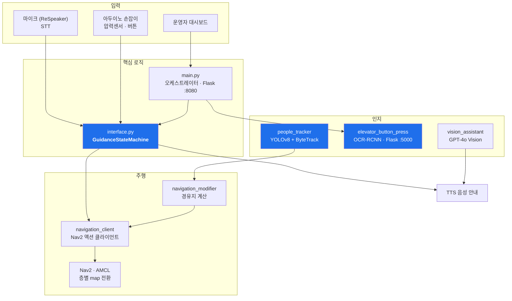

<div align="center">

# 시각장애인 실내 안내 로봇

**상용 로봇 플랫폼 위에, 엘리베이터를 스스로 타고 층을 넘어가는 안내 시스템을 소프트웨어로 구현한다**

[](https://docs.ros.org/en/humble/)
[](https://navigation.ros.org/)
[](https://hello-robot.com/)
[](https://docs.ultralytics.com/)
[]()

단국대학교 배리어프리 ICT기술 연구센터(ITRC) 과제 · 단독 개발 · 2025.12 ~ 진행 중

</div>

<div align="center">

<br><sub>엘리베이터 캐빈 안, 그리퍼 카메라 시점. 버튼마다 라벨과 신뢰도를 붙이고 목표 버튼(0.27 m)에 정렬을 마친 상태다.<br>글자를 읽지 못한 버튼은 <code>~?</code>로 표시하고 배치 패턴으로만 추정한다</sub>
</div>

<div align="center">

### 데모 영상

<a href="https://www.youtube.com/watch?v=3vwIzmuHD_s">

</a>
<a href="https://www.youtube.com/watch?v=SAGndz1JyPY">

</a>

<sub>왼쪽 — **1층 출발 → 엘리베이터 자율 탑승 → 5층 504호 도착** 전 구간 (정상 시나리오 1회)<br>
오른쪽 — ITRC 인재양성대전(코엑스) 시연 &nbsp;·&nbsp; 이미지를 누르면 영상이 열린다</sub>

</div>

---

## 한눈에 보기

| | |
|---|---|
| **문제** | 시각장애인의 실내 이동에서 가장 막히는 건 **층간 이동**이다. 엘리베이터는 버튼 위치가 제각각이고, 터치 패널이면 아예 쓸 수 없다 |
| **접근** | 상용 로봇 플랫폼(Hello Robot Stretch SE3) 위에 **플랫폼이 제공하지 않는 엘리베이터 자율 탑승**을 얹어 층간 이동을 자동화 |
| **왜 어려운가** | 로봇–엘리베이터 연동은 **승강기 제조사·제작 연도마다 제어 방식이 달라 표준 API가 없다.** 국가표준(KS)도 제정 중이다 |
| **해결 방식** | 표준 API에 의존하지 않고 **그리퍼 카메라로 버튼을 직접 인식·가압**한다 |
| **성과** | 엘리베이터 자율 탑승을 포함한 **1층 → 5층 목적지 end-to-end 통합 검증** · ITRC 인재양성대전(코엑스) 시연 |
| **설계 원칙** | 사용자는 실패를 볼 수 없다 → **LLM에 의도 해석만 맡기고 최종 확정은 물리 버튼** · 뒤따르는 사람을 Nav2 footprint에 포함 |
| **문서** | [실행 매뉴얼](docs/RUNBOOK.md) · [하드웨어 사양](docs/HARDWARE.md) · [Navigation & SLAM 가이드](navigation-and-slam-guide.md) |

---

## 목차

1. [설계는 인터뷰에서 시작했다](#1-설계는-인터뷰에서-시작했다)
2. [시스템 아키텍처](#2-시스템-아키텍처)
3. [엘리베이터 자율 탑승](#3-엘리베이터-자율-탑승)
4. [사회적 규범 기반 주행](#4-사회적-규범-기반-주행)
5. [조용한 실패 — 안전 설계](#5-조용한-실패--안전-설계)
6. [현장 계측 체계](#6-현장-계측-체계)
7. [모듈 구성](#7-모듈-구성)
8. [실행 · 문서](#8-실행--문서)
9. [한계와 다음 단계](#9-한계와-다음-단계)

---

## 1. 설계는 인터뷰에서 시작했다

기능을 정하기 전에 **시각장애인 당사자와 심층 인터뷰**를 진행했다. 초기 구상은 세 가지였다.

| 초기 아이디어 | 인터뷰 반응 | 결정 |
|---|---|---|
| 흐름 기반 안내 (사람 사이 통과) | **긍정** — *"남과 부딪혀 항의받은 경험이 있다"* | 채택 |
| 엘리베이터 층간 이동 | **조건부 긍정** — 물리 버튼은 무난, 터치 패널은 스트레스 | 채택 |
| 장애물 밀고 가기 | **반대** — *"밀린 물건이 내 쪽으로 오거나 발에 걸릴 수 있다"* | **보류** |

장애물 밀기는 [프로토타입까지 구현했지만](src/blind_nav_system/blind_nav_system/obstacle_pusher/README.md), 인터뷰 결과에 따라 **기본 동작에서 제외**했다. 참가자의 지적이 정확했다 — 사용자는 안내자의 5시/7시 방향 한 발 뒤에 서 있으므로, 밀린 물건이 향하는 곳이 곧 사용자의 발밑이다.

인터뷰에서 얻은 것 중 가장 중요했던 문장:

> **"기능을 많이 넣지 말고 누구나 쉽게 쓰는 단순한 형태로."**
> **"안내의 본질은 안내자의 편안함이다. 이 기준을 못 맞추면 외면받는다."**

그리고 실질 수요처가 **익숙한 곳이 아니라 병원 같은 '낯선 실내'**라는 점도 여기서 확인했다. 층간 이동에 집중한 이유다.

---

## 2. 시스템 아키텍처



주행 스택은 Nav2를 사용하되, **사람 회피 로직을 위해 fork(`bell-ha/human-nav`)를 두고 `nav2_params_human.yaml`로 파라미터를 분리**했다. colcon 패키지가 아니라 `python3` 직접 실행 방식이다.

### 바퀴 제어권은 한 번에 한 곳만 갖는다

여정을 6단계로 쪼개고, **단계마다 바퀴를 움직일 수 있는 주체를 하나로 못박았다.**

<div align="center">

</div>

주행 구간에서는 Nav2가, 엘리베이터 캐빈 안에서는 버튼 조작 앱이 제어권을 갖는다. 나머지 구간은 **잠금**이다.

이렇게 나눈 이유는 통합 과정에서 겪은 문제 때문이다. 엘리베이터 앱이 팔을 뻗어 버튼을 누르는 동안 Nav2가 아직 살아 있으면, **두 주체가 동시에 로봇을 움직이려 든다.** 사람이 손잡이를 잡고 뒤에 서 있는 상태에서 이런 경합이 나면 그대로 물리 사고다. 그래서 기능을 더 붙이기 전에 제어권부터 배타적으로 만들었다.

---

## 3. 엘리베이터 자율 탑승

### 왜 표준 API를 못 쓰나

로봇이 엘리베이터를 타는 문제는 국내에서 **아직 표준화가 끝나지 않은 영역**이다.

- 승강기 제조사마다, **같은 제조사라도 제작 연도마다 제어 방식이 다르다**
- 현대엘리베이터가 로봇 연동 오픈 API를 공개한 것이 2023년이고, 그 이전에는 각 로봇사가 개별 대응해야 했다
- 로봇–엘리베이터 탑승 안전요구사항 국가표준(KS)은 현재 제정 진행 중이다

그래서 **연동 프로토콜에 의존하지 않는 경로**를 택했다. 사람이 하는 것과 같은 방식 — 눈으로 보고 손으로 누른다.

### 동작


**노란 단계가 안전 설계다.** 로봇이 버튼을 찾고 정렬까지 자동으로 하지만, **실제로 누르는 동작은 사용자의 명시적 승인 한 번을 거친다.** 팔이 사람 옆에서 움직이는 동작이므로 자동화하지 않았다.

### 층 전환이 진짜 어려운 지점

버튼을 누르는 것보다 어려운 건 **층이 바뀐 뒤다.** 로봇은 자기가 몇 층인지 모른다.

- 지도를 `floor3` → `floor4`로 교체한다
- 교체 직후 AMCL은 **이전 층의 위치를 그대로 믿고 있다** → `initialpose`로 재초기화
- 재초기화가 실패하면 **4층인데 3층 지도로 주행**하게 된다

`maps/`에 `floor3` · `floor4` · `itrc` · `coex` · `all` 등 층·장소별 지도를 두고 전환한다. 엘리베이터 캐빈 내부도 [별도로 매핑](src/blind_nav_system/blind_nav_system/cabin_mapping/README.md)했다.

<div align="center">

<br><sub>엘리베이터 앞 호출 버튼 접근. 우측 상단에 층 표시기 "5"가 보인다</sub>
</div>

---

## 4. 사회적 규범 기반 주행

> **논문 타겟: ACM CHI**

**기존 Nav2는 사람을 단순 장애물로 취급한다.** 벽과 똑같이 피한다. 그런데 사람은 움직이고, 마주 오는 사람과 나란히 걷는 동행자는 완전히 다른 존재다.

`people_tracker`는 사람을 **이동 방향으로 분류**해 주행에 반영한다.

```
머리 카메라 (RGB + aligned_depth)
   ↓  YOLOv8n + ByteTrack        카메라 90° 회전 보정 후 추론 → bbox 역변환
   ↓  거리 추정                   depth patch (0~6 m 정밀) → 실패 시 bbox 높이 (6~9 m)
   ↓  좌표 변환                   TF2: camera_color_optical_frame → map
   ↓                              ※ depth 메시지 타임스탬프 기준 — 주행 중 위치 오차 방지
   ↓  속도 벡터                   선형회귀 8프레임 (bbox 추정 시 4프레임 이상 필요)
   ↓  분류                        로봇 yaw와 비교 → 접근자 / 동행자 / 정지
   ↓
navigation_modifier → 경유지 계산 → Nav2 재계획
```

- **접근자** — 마주 오는 사람. 오른쪽으로 양보하는 경유지를 넣는다
- **동행자** — 같은 방향으로 이동. 경로 힌트로 사용한다
- **정지** — 서 있는 사람. 일반 장애물로 취급한다

거리 추정이 이중화되어 있는 이유는, depth 카메라가 6 m를 넘으면 신뢰할 수 없기 때문이다. 그 구간은 bbox 높이로 추정하되 **추정값임을 마커에 표시**(반투명 + `~` 접두사)해 구분한다.

### 사람을 로봇의 footprint 안에 넣었다

경로 계획 레벨에서도 같은 문제를 다뤘다. **사용자는 로봇 뒤에 서서 손잡이를 잡고 따라온다.**
Nav2는 로봇만 보고 경로를 짜므로, 로봇이 지나갈 수 있는 좁은 틈이라도 **뒤따르는 사람은 벽에 부딪힌다.**

`nav2_params_human.yaml`에서 파라미터를 이렇게 바꿨다.

| 항목 | 값 | 이유 |
|---|---|---|
| **footprint** | **5각형, 뒤 −0.85 m** | **뒤에 서 있는 사람을 footprint 안에 포함시킨다.** 로봇의 물리적 크기를 사람까지 확장한 것 |
| **min_vel_x** | **0.0** | **후진 완전 차단.** 뒤에 사람이 있으므로 |
| inflation_radius | 0.45 m | 벽에서 45 cm 이상 유지 |
| cost_scaling_factor | 2.5 | 복도 중앙으로 경로 유도 |
| max_vel_theta | 0.5 rad/s | 부드러운 회전 |

**"사람이 뒤에 있다"는 물리 제약을 알고리즘이 아니라 파라미터로 표현**한 것이다.
사람 회피 로직을 위해 Nav2를 fork(`bell-ha/human-nav`)하고 파라미터 파일을 분리한 이유이기도 하다.

---

## 5. 조용한 실패 — 안전 설계

이 프로젝트의 제약은 하나로 요약된다.

> **사용자는 로봇의 실패를 볼 수 없다.**

로봇이 엉뚱한 층에 내려도, 주행이 멈춰도, 목적지를 잘못 잡아도 — 시각장애인 사용자는 알아챌 방법이 없다. **화면에 에러가 뜨는 것은 이 시스템에서 아무 의미가 없다.**

### LLM에 무엇을 맡기지 않았나

음성 명령 해석에 GPT를 쓴다. 그런데 **로봇을 실제로 움직이는 결정을 LLM에 맡기지 않았다.**
[`interface-spec.md`](src/blind_nav_system/blind_nav_system/interface-spec.md)에 원칙 세 줄로 못박아 두었다.

> **GPT는 의도 해석만 한다**
> **최종 상태 전이는 코드가 한다**
> **최종 확정은 항상 버튼이다**

상태는 `LOCKED` · `READY` · `NAV` · `PAUSED` **4개로 고정**했다. LLM은 "3층 회의실 가자"를
목적지 후보로 바꾸는 데까지만 관여하고, 그 후보를 실제 이동으로 승격시키는 것은 코드이며,
최종 확정은 **사용자가 물리 버튼을 누르는 것**이다.

LLM이 잘못 해석했을 때 로봇이 그대로 움직이면, 눈이 보이지 않는 사용자는 잘못 가고 있다는 것을
알 수 없다. **자연어 이해와 물리적 실행 사이에 사람이 누르는 버튼 하나를 반드시 두는 것**이
이 시스템의 신뢰 경계다.

### 조용한 실패 카탈로그

그래서 겉으로 드러나지 않는 실패를 찾아 카탈로그화했다. 현재 **결함 27건**을 증상 · 위치 · 심각도 · 확증/정황 구분으로 기록하고 안전 항목부터 순차 해결하고 있다.

| # | 사용자가 겪는 증상 | 심각도 |
|---|---|---|
| L | 다른 층을 말했는데 현재 층 같은 자리로 데려가고 "도착했습니다" | 🔴 안전 |
| 3 | 여정을 취소했는데 엘리베이터 앞으로 56.5 cm 전진 + 90° 회전 | 🔴 안전 |
| 2 | 손잡이를 당겨 일시정지했는데 로봇이 계속 감 | 🔴 안전 |
| 6 | 지도 전환이 실패해도 진행 → 4층인데 5층 지도로 주행 | 🔴 |
| 18 | 두 오케스트레이터 불일치로 가짜 도착 또는 200초 침묵 | 🔴 |

기록 방식에 두 가지 규칙을 두었다.

- **확증 / 정황을 구분한다.** 코드로 증명한 것과 로그·상관관계로 추정한 것을 섞지 않는다
- **증상을 사용자 관점으로 쓴다.** "반환값 미검사"가 아니라 "취소했는데 로봇이 전진한다"로 쓴다. 그래야 심각도를 판단할 수 있다

발견과 수정 과정은 [FINDINGS](.claude/FINDINGS.md) · [DECISIONS](.claude/DECISIONS.md)에 기록되어 있다.

---

## 6. 현장 계측 체계

실기체 디버깅에서 가장 어려운 건 **"그때 무슨 상태였는지"를 나중에 재구성하는 것**이다. 로그만으로는 부족하다.

주요 지점에서 **카메라 2대 영상 + 로봇 상태를 한 시점에 묶어 저장**하는 스냅샷 체계를 만들었다.

```
snapshots/20260902T182307_5층버튼누르는지점/
├── body_color.jpg      body 카메라 (D435if)
├── grip_color.jpg      그리퍼 카메라 (D405)
├── grip_depth.png      그리퍼 뎁스
└── meta.json
```

```json
{ "label": "5층 버튼 누르는 지점", "floor": "5",
  "wall_time": "2026-09-02T18:23:08+0900",
  "battery": { "voltage": 12.1, "charging": false },
  "amcl_pose": { "x": -47.454, "y": 4.993, "yaw_deg": 168.4 },
  "localization_available": true,
  "joint_states": { "joint_lift": 0.9399, "wrist_extension": 8.37e-06, ... } }
```

배터리를 `pct`가 아니라 **`voltage`로 기록**하는 이유가 있다. Stretch는 `pct`를 자주 `NaN`으로 반환하는데, 과거 `round(NaN)`이 ROS2 spin 스레드를 죽여 도착·실패 감지가 통째로 멈춘 적이 있다. 이후 모든 배터리 판단을 voltage 기준으로 바꿨다.

### 계측이 원인 규명으로 이어진 사례

주행 중 로봇이 간헐적으로 멈추는 문제가 있었다. 눈으로 보면 그냥 멈칫할 뿐이라
원인을 짐작할 수 없었다. 전날 만들어 둔 **블랙박스 로그**(`~/.ros/robot_diag/nav/`)로
멈춤 시각(17:05 · 17:11 · 17:15 · 17:17 · 17:21 · 17:22)을 로그와 대조했다.

| 로그 | 횟수 |
|---|---|
| `Controller patience exceeded` | 30 |
| `Aborting handle` | 44 |
| `Unable to transform robot pose into global plan's frame` | 85 |
| **`Control loop missed its desired rate`** | **33** ← 컨트롤러가 CPU에 밀렸다는 증거 |

**결론: CPU 타이밍 압박.** AMCL·컨트롤러가 제때 돌지 못해 순간적으로 위치를 잃고 경로를 포기한 것이다.

가능한 다른 원인은 로그로 배제했다.
- **엘리베이터 과부하 아님** — 멈춤이 엘베 ON 구간과 OFF 구간 모두에서 발생
- **중복 스택 아님** — ROS 노드 35개 전부 고유, `ros2 launch` 1개
- **`map 프레임 없음` 537회는 무관** — 전부 부팅 직후 16:59~17:04, 초기 위치를 주기 전 startup 전이

CPU를 잡아먹던 `vision_assistant`(상시 43%)를 정리해 해결했다.
같은 날 **1층 → 5층 엘리베이터 시나리오를 완주**했다.

전체 기록: [작업기록-2026-08-10](작업기록-2026-08-10.md) · [작업기록-2026-08-13](작업기록-2026-08-13.md)

---

## 7. 모듈 구성

```
src/blind_nav_system/blind_nav_system/
├── main.py                  오케스트레이터 — Flask :8080 관제 대시보드, 엘베 자동 여정(_auto_run)
├── interface.py             음성 인터페이스 — STT/TTS · GuidanceStateMachine · 아두이노 손잡이
├── navigation_client.py     Nav2 액션 클라이언트 — 사회적 회피 포함 재계획
├── navigation_modifier.py   경유지 계산 — 접근자 회피 / 동행자 경로 힌트
├── vision_assistant.py      시각 보조 — RealSense → GPT-4o Vision → TTS
├── robot_diag.py            로봇 상태 진단
├── robot_diag_nav.py        주행 진단 (/rosout 실패 이력 영속화)
│
├── elevator_button_press/   엘리베이터 버튼 인식·가압 (Flask :5000)
│   ├── main.py · ocr_rcnn_server.py
│   └── button_layout.json · aim_trim.json
├── people_tracker/          사람 검출·분류 (YOLOv8 + ByteTrack, 별도 프로세스)
│   └── tracker · direction · flow · ros_publisher · visualization · utils
├── obstacle_pusher/         장애물 밀기 — 인터뷰 결과에 따라 기본 동작에서 보류
│   └── main · obstacle_detector · push_probe
├── cabin_mapping/           엘리베이터 캐빈 내부 매핑 (기록/렌더 분리)
│   └── cabin_capture · cabin_render
├── snapshots/               현장 계측 기록
└── tools/                   독립 도구 — audio_web_test · mouse_teleop · armleft · hardware/
```

**설계 원칙 하나**: `cabin_capture.py`는 `cmd_vel`을 발행하지 않는다. 팔·리프트도 명령하지 않고 `/initialpose`도 쏘지 않는다. **기록 전용이라는 것이 이 스크립트의 유일한 안전 근거**이기 때문이다. 이동은 100% 사람이 게임패드로 한다.

---

## 8. 실행 · 문서

실행 명령어는 전부 **[실행 매뉴얼 (RUNBOOK)](docs/RUNBOOK.md)** 에 있다.

```bash
# 1. 로봇 초기화 → 2. 런치 (켜고 유지) → 3. RViz 초기 위치 → 4. 인터페이스
ros2 launch blind_nav_system stretch_robot_process.launch.xml
python3 interface.py
```

| 문서 | 내용 |
|---|---|
| [docs/RUNBOOK.md](docs/RUNBOOK.md) | **모든 실행 명령어**, 설정 파일, 자주 겪는 문제 |
| [docs/HARDWARE.md](docs/HARDWARE.md) | 하드웨어 사양, 카메라 시리얼 고정, 물리 제약 |
| [navigation-and-slam-guide.md](navigation-and-slam-guide.md) | Navigation & SLAM 가이드 |
| [interface-spec.md](src/blind_nav_system/blind_nav_system/interface-spec.md) | `interface.py` 상세 구현 명세 |
| [.claude/FINDINGS.md](.claude/FINDINGS.md) | 결함 카탈로그 (확증/정황 구분) |
| [.claude/DECISIONS.md](.claude/DECISIONS.md) | 설계 결정 로그 (상황 → 분석 → 결정 → 변경 → 결과) |

---

## 9. 한계와 다음 단계

**현재 한계**

- 1층 → 5층 층간 이동은 **정상 시나리오에서 1회 완주**했다. 반복 성공률은 아직 측정하지 않았다
- 개별 모듈은 안정적이나 **통합 구간의 상태 경합**이 남아 있다 (FINDINGS 참조)
- 터치식 패널 엘리베이터는 대응하지 못한다 — 인터뷰에서도 지적된 부분이다

**다음**

- 단계별 성공률 측정 — ① 엘베 앞 도달 ② 버튼 인식 ③ 가압 ④ 층 전환 후 재측위 ⑤ 최종 도달
- 결함 27건 중 안전 등급 우선 해결
- `people_tracker` 사회적 규범 주행 논문화 (ACM CHI 타겟)

---

<div align="center">

**이종하** · [GitHub](https://github.com/bell-ha) · [Portfolio](https://bell-ha.github.io)

</div>
