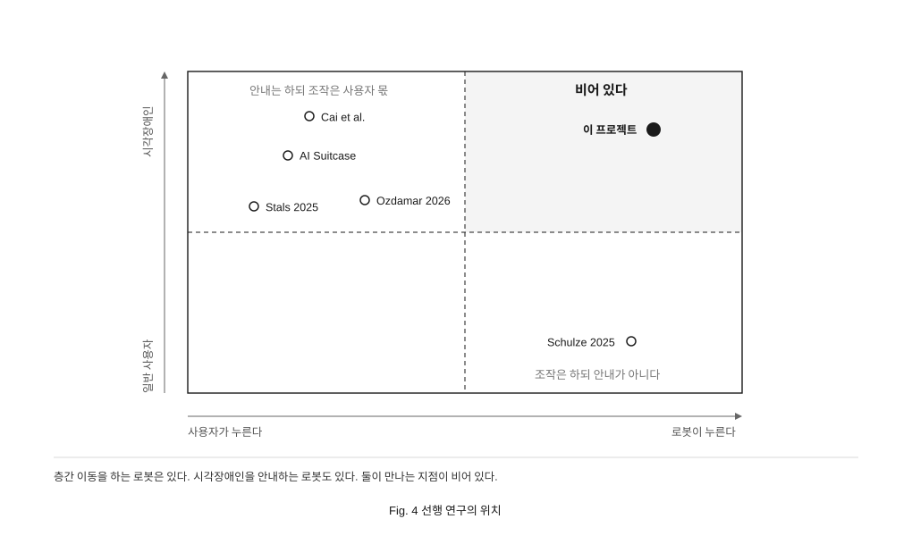
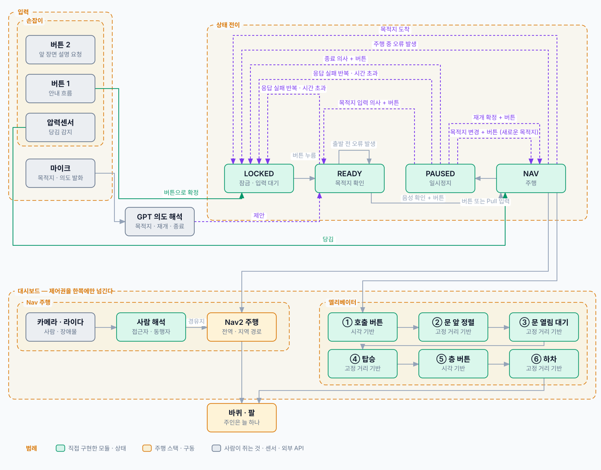
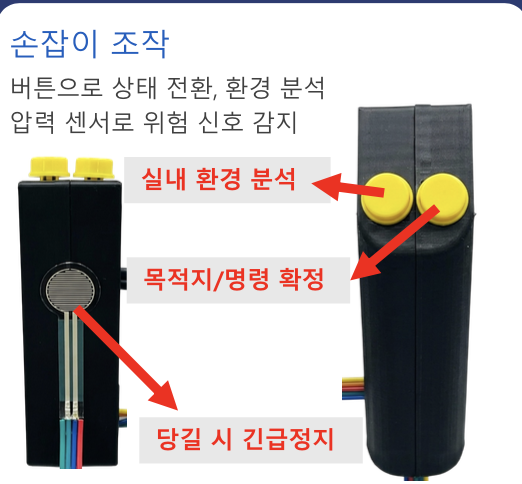
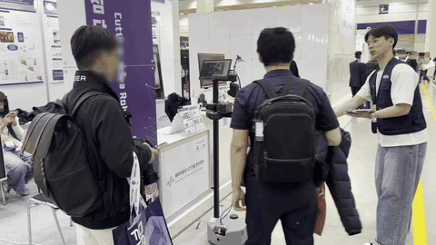
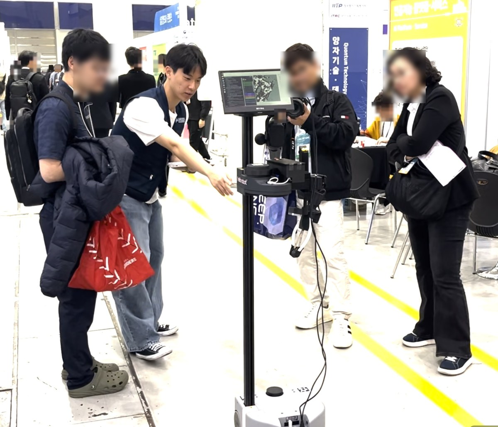

<div align="center">

# SoNA (Social Norm-Aware Indoor Navigation Assistant)

사회적 규범 인식 기반 실내 자율 안내 로봇 시스템

[](https://docs.ros.org/en/humble/)
[](https://navigation.ros.org/)
[](https://hello-robot.com/)
[](https://docs.ultralytics.com/)

2025.12 ~ 진행 중 · 단독 개발 · ITRC 과제

</div>

---

## Impact

| | |
|---|---|
| **4 개의 상태** | LOCKED, READY, NAV, PAUSED 네 상태를 버튼과 음성으로만 이동 |
| **사회적 규범** | 사람의 방향을 탐지해 양보 및 추적 · 엘리베이터 1층→5층 이동 |
| **결함 관리** | 직접 기록한 결함 239건, 사용자 입장에서 해결 |
| **당사자 인터뷰** | 요구 3건 전부 반영, 밀기 기능은 제거 희망 |

---

## Background

ITRC 과제로 만든 사회적 규범 인식 기반 실내 자율 안내 로봇 시스템입니다.
시각장애인 사용자가 손잡이를 잡고 로봇을 따라 걸으면 목적지까지 데려다줍니다.

이전에도 시각장애인용 안내 로봇은 있었지만, **엘리베이터 버튼을 직접 누르는 것**과
**사회적 규범 인식**(주변 사람을 추적해 피하거나 따라가는 것)은 구현되지 않았습니다.

<div align="center">

</div>

| 선행 연구 | 다층 | 시각장애인 | 로봇이 가압 |
|---|:---:|:---:|:---:|
| Schulze 2025, *Front. Robot. AI* | ✅ | ❌ | ✅ |
| Takagi 2025 — AI Suitcase (IBM·CMU) | 부분 | ✅ | ❌ |
| Cai et al. 2026, *HRI* — *Navigation beyond Wayfinding* | ✅ | ✅ | ❌ |
| Ozdamar 2026, *IJRR* | ❌ | ✅ | ❌ |
| Stals 2025, *HRI* | ❌ | ✅ | ❌ |
| **이 프로젝트** | ✅ | ✅ | ✅ |

버튼을 못 보는 사람에게 "앞까지 데려다 줄 테니 누르세요"는 문제를 옮긴 것입니다.

당사자 인터뷰를 통해 기능을 구체화했습니다.

- 마주 오는 사람은 방향을 보고 피하고, 같은 방향으로 가는 사람은 따라갈 것
- 엘리베이터는 스스로 타고 층을 넘을 것
- 사람과 부딪히는 일이 없어야 하고, 움직이기 전에 사용자의 결정을 따를 것

상용 제품(Hello Robot Stretch SE3) 위에 손잡이를 제작해 장착하고,
주행·사람 추적·음성·엘리베이터 기능과 이것들을 묶는 상태 기계를 구현한 시스템입니다.

---

## Architecture

<div align="center">

</div>

입력(손잡이·마이크)이 상태 전이를 움직이고, 대시보드가 **주행과 엘리베이터 중 한쪽에만 제어권**을 넘깁니다.
둘이 동시에 살아 있으면 바퀴를 같이 움직입니다 — 사람이 뒤에서 손잡이를 잡고 있으면 그대로 물리 사고입니다.

한 프로세스에 몰아넣지 않았습니다. **죽으면 안 되는 것부터 떼어냈습니다.**
ROS2 노드 35개 · Flask 서버 2개(`:8080` 관제 · `:5000` 버튼 앱) · 층·장소별 지도 8종.

프로세스를 어떻게 갈랐는지는 [설계 노트 5-4](docs/DESIGN.md)에 있습니다.

---

## Contributions

근거와 측정값은 [설계 노트](docs/DESIGN.md)에 있습니다.

### 손잡이 — 버튼 둘과 압력센서



Autodesk Fusion으로 설계해 3D 출력합니다. 버튼 2개와 압력센서를 아두이노로 읽습니다.

- 버튼 하나는 주변 환경을 분석해 들려줌
- 다른 버튼은 GPT가 해석한 의도를 수락
- 압력센서를 당기면 어떤 상태에 있든 PAUSED로 전환

버튼을 늘리는 대신 **하나가 상태에 따라 뜻이 달라지게** 했습니다. 손으로 더듬어 찾는 버튼은 적을수록 좋습니다.
압력은 세기가 아니라 **올라가는 속도**로 당김을 가릅니다 — 걷는 내내 쥐고 있으니 세기는 신호가 못 됩니다.

<br clear="right"/>

### OCR-RCNN으로 층 버튼 인식과 가압

승강기는 제조사와 연식마다 제어 방식이 달라 연동에 쓸 수 있는 표준이 없습니다.
OCR-RCNN으로 그리퍼 카메라 영상에서 버튼을 인식해 직접 누릅니다.

- 호출 버튼을 누르고 탑승한 뒤, 캐빈 안에서 목표 층 버튼을 누름
- 글자를 못 읽은 버튼은 배치로 추정
- 층이 바뀌면 지도를 교체

### 사용자를 포함한 로봇 크기

손잡이를 쥐고 선 사용자까지 포함해 로봇 크기를 뒤로 0.9 m 확장하고 Nav2에 적용했습니다.
Nav2는 로봇만 보고 경로를 짜기 때문에, 로봇이 지나갈 수 있는 틈에서 뒤따르는 사람은 벽에 부딪힙니다.
**"사람이 뒤에 있다"를 알고리즘이 아니라 파라미터로 표현**했습니다.

### 사람 인식 기반 경로 수정

로봇이 향한 방향과 사람의 이동 방향을 비교해 주행합니다 (YOLOv8n + ByteTrack).

- **접근자** — 마주 오는 사람. Nav2 원칙으로 회피
- **동행자** — 같은 방향으로 가는 사람. 그 진행 방향을 경로에 40%만큼 반영 (`COMPANION_BLEND = 0.4`)

### 음성 해석과 실행 사이 물리 버튼

GPT는 말을 의도로 바꾸는 데까지만 사용합니다.

- 해석한 결과를 음성으로 들려주고, 손잡이 버튼을 눌러야 실행
- LLM이 오해석해도 로봇은 움직이지 않음

### 장애물 밀기 — 구현 후 폐기

경로 위의 물체가 밀 수 있는 것인지 종류로 판단해 밀고 지나가는 기능을 만들었습니다.
당사자 인터뷰에서 원하지 않는다는 답을 듣고 폐기했습니다.
사용자는 안내자의 한 발 뒤에 섭니다. **밀린 물건이 향하는 곳이 사용자의 발밑입니다.**

### 1층에서 5층까지

단국대학교 2공학관 1층에서 504호까지 주행을 완료했습니다.

- 목적지 선택 · 승차지점 주행 · 엘리베이터 시퀀스 · 지도 전환 · 5층 목적지 주행 · 도착 안내

2026년 8월 13일, 호출 가압 · 문 앞 정렬 · 문 열림 대기 · 탑승 · 층 가압 · 하차의
여섯 단계가 사람의 개입 없이 한 번에 이어졌습니다.

<div align="center">
<a href="https://www.youtube.com/watch?v=3vwIzmuHD_s">

</a>
<br><sub>1층 → 엘리베이터 자율 탑승 → 5층 504호 전 구간 · <a href="https://youtu.be/3vwIzmuHD_s">youtu.be/3vwIzmuHD_s</a></sub>
</div>

### ITRC 인재양성대전 부스 시연

<div align="center">
<table>
<tr>
<td></td>
<td></td>
</tr>
</table>
</div>

코엑스에서 열린 ITRC 인재양성대전에서 부스를 열고 시연했습니다.
관람객이 직접 체험하게 했고, 화면에 지도와 주행 로그를 함께 띄웠습니다.

<div align="center">
<a href="https://www.youtube.com/watch?v=SAGndz1JyPY">

</a>
<br><sub>음성 목적지 변경 · 손잡이 조작 (2공학관 촬영, 부스 상영) · <a href="https://youtu.be/SAGndz1JyPY">youtu.be/SAGndz1JyPY</a></sub>
</div>

---

## Troubleshooting

### 아래쪽 층 버튼을 못 찾음

- **문제** OCR-RCNN이 아래쪽 층 버튼을 자주 놓침
- **원인** 팔이 좌우로 움직이지 못해 도달 자체가 막힘. 스냅샷 24세트에서 `cam_x`가 전부 소수 4자리까지 동일. OCR-RCNN에는 깊이가 없어 인식 정확도를 올려도 안 풀림
- **해결** 각도와 거리를 달리해 여러 장을 찍음. 카메라 파라미터로 3차원 좌표를 복원. 못 읽은 버튼은 격자 보간으로 유추
- **결과** 촬영일·자세·거리가 다른 독립 3측정, 여섯 개 간격 전부 **4.8 mm** 안에서 일치

### 하드코딩한 이동 거리로 인한 오차

- **문제** 엘리베이터 시나리오의 바퀴 이동이 상수. 56.5 · 185 · 186 cm. 미끄러지면 실제 이동량이 어긋남
- **원인** 오도메트리가 끊기면 간 거리를 모름. 그래서 명령한 값을 간 것으로 기록. 오차가 회차마다 쌓임
- **해결** 좌표 기반 3단 정렬로 교체. 고정 거리 의존 구간을 최소로 줄이고 나머지는 매 회차 다시 측정
- **결과** 시뮬 50회 중앙값에서 횡오차 16.3 cm → 잔여 1 cm · 3°

### 자율주행 중 5초마다 멈춤

- **문제** 주행이 간헐적으로 멈춤. 조건 특정 불가
- **원인** 주행과 엘베 앱을 번갈아 돌리자 둘이 점유를 다툼. costmap 드롭 838회(엘베 OFF면 0회). 2차로 `vision_assistant`가 상시 CPU 43%
- **해결** 대시보드가 제어권을 한쪽에만 부여. 매 프레임 JPEG 인코딩을 요청 시점으로 이전
- **결과** 드롭 0 · 정상 도착. idle 43% → 약 0%

> 이날 세 번 헛짚었습니다. "RViz가 라이다를 죽인다", "그리퍼 카메라가 얼었다", "중복 nav 스택" — 전부 틀렸습니다.
> **노이즈 측정으로 결론 내기 전에 검증합니다.**

### 결함을 목록으로 관리

결함을 목록으로 관리하며 안전 항목부터 처리합니다.
재현되지 않은 것은 취소로 표시해 남깁니다 — **확증과 정황을 한 칸에 적으면 목록 전체를 믿을 수 없습니다.**
증상은 코드가 아니라 사용자 관점으로 적습니다.

| # | 사용자가 겪는 증상 | 심각도 |
|---|---|---|
| L | 다른 층을 말했는데 현재 층 같은 자리에서 "도착했습니다" | 🔴 |
| 3 | 여정을 취소했는데 엘베 앞으로 56.5 cm 전진 + 90° 회전 | 🔴 |
| 2 | 손잡이를 당겨 일시정지했는데 계속 감 | 🔴 |
| 6 | 지도 전환 실패해도 진행 → 4층인데 5층 지도로 주행 | 🔴 |

---

## 실행

로봇(Stretch SE3) 위에서 도는 시스템입니다. 명령 전문과 자주 겪는 문제는 [RUNBOOK](docs/RUNBOOK.md)에 있습니다.

```bash
# 1. 로봇 상태 점검 · 홈
stretch_robot_battery_check.py && stretch_free_robot_process.py && stretch_robot_home.py

# 2. 가상환경
source src/blind_nav_system/venv/bin/activate

# 3. 전체 기동 (ROS2 노드 · 관제 :8080 · 버튼 앱 :5000)
ros2 launch blind_nav_system stretch_robot_process.launch.xml

# 4. RViz 에서 2D Pose Estimate 로 초기 위치 지정
ros2 run rviz2 rviz2
```

> [!NOTE]
> `people_tracker`는 런치에 포함돼 있지 않아 **기본 구성에서는 뜨지 않습니다.**
> 별도 프로세스로 직접 실행해야 합니다. 발행자가 없으면 구독자는 조용히 아무것도 하지 않습니다.

---

## 한계

| 한계 | 왜 남아 있나 | 다음 |
|---|---|---|
| **정상 시나리오 1회.** 반복 성공률 미측정 | 통합 완주가 최근이고 세션마다 환경이 다르다 | 단계별 성공률 측정 |
| **내려가는 시나리오를 못 돈다** | 호출 버튼 ▲/▼ 중 하나만 인식된다 | 앵커 로직에서 ▲▼ 구분 |
| **탑승이 문 닫힘 시간을 못 맞춘다** | 전진 185 cm를 제한 시간에 못 끝낸다 | 속도·타이밍 조정 |
| **좌표 기반 정렬 실기체 미검증** | 시뮬·정지 계산까지만 | odom·AMCL 동시 로깅 |
| 버튼 매핑이 오프라인에 머문다 | 손끝 TF가 없고, 위치제어 팔이 **막혀도 도달했다고 보고**한다 | TF 추가 · 버튼 점등으로 접촉 판정 |
| 깊이 스케일 +6% 미해소 | 깊이 단위와 리프트 기구학 오차가 축퇴 | 알려진 치수 물체 촬영 |
| CPU 최적화 효과 미측정 | idle은 확인, 멈춤 감소는 미확인 | patience 초과 전후 대조 |
| 사회적 규범 주행 효과 미검증 | 파라미터 설계까지만 | 근접 이벤트 감소 측정 |
| 터치 패널 미대응 | 물리 가압의 원리적 한계 | 연동형 병행 검토 |

**한 번 이어진 것을 여러 번 이어지게 만들고, 시뮬에서 맞춘 것을 실기체에서 확인하는 것**이 다음입니다.

---

## 문서

| | |
|---|---|
| [설계 노트 (DESIGN)](docs/DESIGN.md) | 왜 그렇게 만들었나 — 볼 수 없는 사용자 · 엘리베이터 · 통합 |
| [실행 매뉴얼 (RUNBOOK)](docs/RUNBOOK.md) | 모든 실행 명령어 · 설정 파일 · 자주 겪는 문제 |
| [하드웨어 사양](docs/HARDWARE.md) | 카메라 시리얼 고정 · 물리 제약 |
| [Navigation & SLAM 가이드](docs/NAVIGATION.md) | 맵핑 재현 절차 |
| [기능 명세 (v3)](src/blind_nav_system/blind_nav_system/interface-spec.md) | 상태 4개 · 전이 규칙 · 고정 TTS 문구 |
| [작업 일지](docs/journal/) | 날짜별 실기 기록 · 보류 목록 · 다음 시나리오 |
| [결함 카탈로그 (FINDINGS)](.claude/FINDINGS.md) | 239건 · 확증/정황 구분 |
| [설계 결정 로그 (DECISIONS)](.claude/DECISIONS.md) | 상황 → 분석 → 결정 → 결과 |
| [버튼 3D 매핑 검증 (REPORT_B3)](src/blind_nav_system/blind_nav_system/snapshots/vlm_mapping/out_b3/REPORT_B3.md) | 독립 3측정 교차대조 전문 |
| [참고 문헌](files/) | 시각장애인 안내 · 엘리베이터 조작 |
| [프로젝트 소개 페이지](https://bell-ha.github.io/projects/nav-robot/) | 요약 · 도면 · 데모 |
