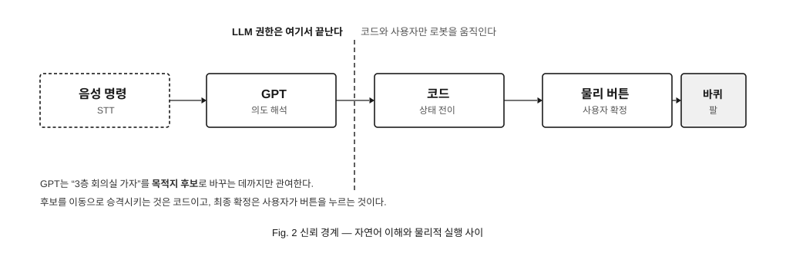
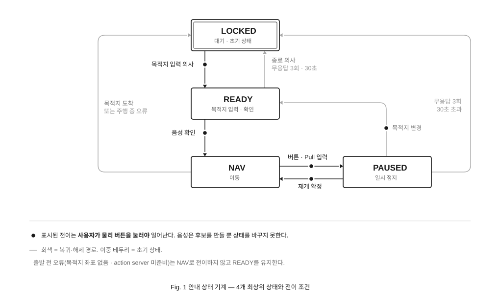
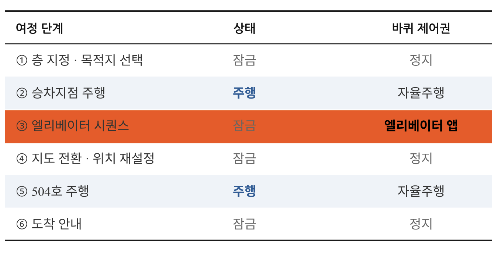
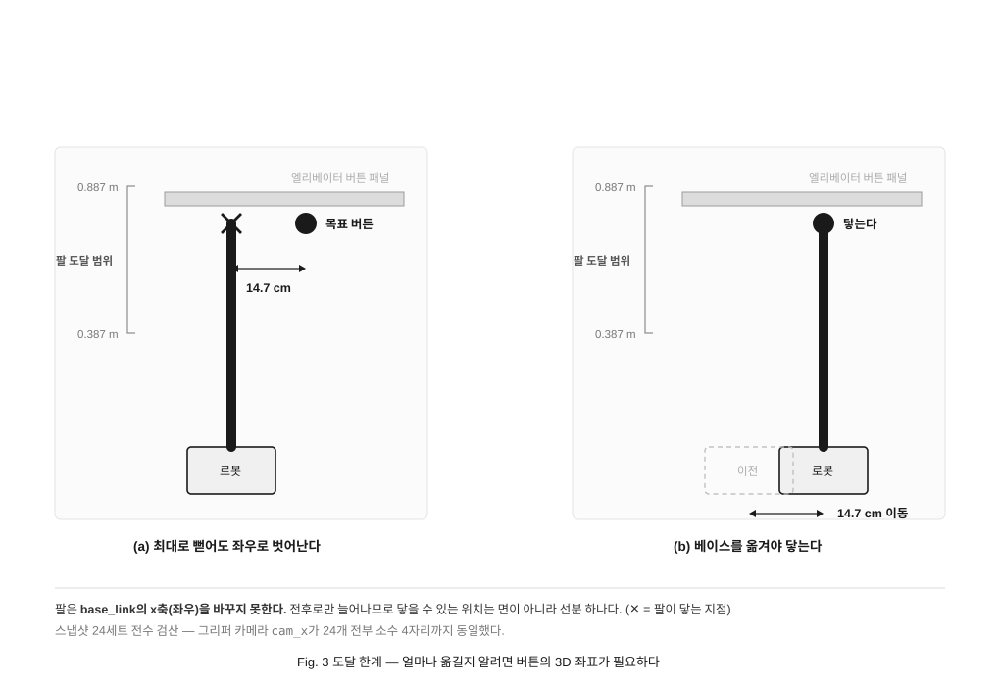
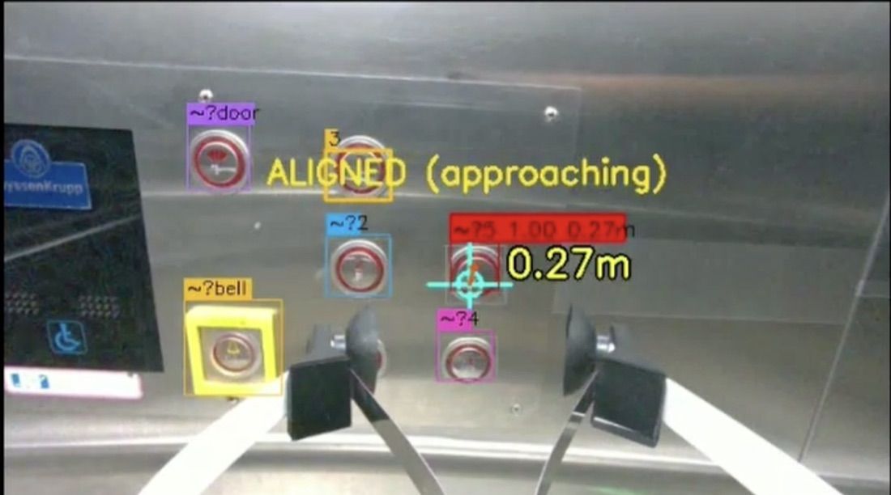
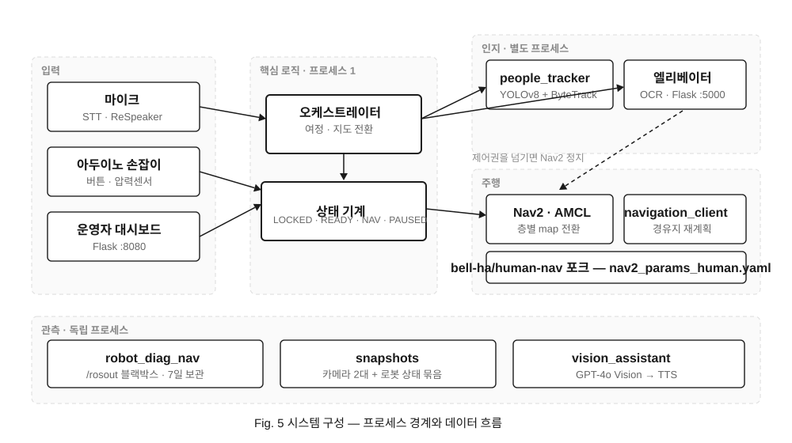

# 설계 노트

왜 그렇게 만들었는지를 남긴 글이다. 무엇을 만들었는지는 [README](../README.md) 에 있다.
세 덩어리다 — 볼 수 없는 사용자를 위한 설계, 엘리베이터 자율 탑승, 그리고 통합.

측정값과 파일·줄 번호는 전부 당시 코드에서 직접 확인한 것이다.
코드가 바뀌면 줄 번호는 어긋날 수 있다.

---

## 3. 볼 수 없는 사용자

> [!IMPORTANT]
> **사용자는 로봇의 실패를 볼 수 없다.** 화면 에러는 이 시스템에서 무의미하다.

### 3-1. 신뢰 경계

<div align="center">

</div>

LLM이 오해석해도 로봇은 움직이지 않는다. 그 사이에 사람이 누르는 버튼 하나가 있다.

### 3-2. 상태 4개

<div align="center">

</div>

세분이 필요하면 상태를 늘리지 않고 `READY_DEST_INPUT` · `READY_CONFIRM` 같은 하위 국면으로 내렸다.
**전이 규칙이 코드 한 곳에서 다 읽혀야 하기 때문**이다.

### 3-3. 제어권

<div align="center">

</div>

주행은 Nav2, 캐빈 안은 버튼 앱, 나머지는 **잠금.** 둘이 동시에 살아 있으면 로봇을 같이 움직인다 —
사람이 뒤에서 손잡이를 잡고 있으면 그대로 물리 사고다.

### 3-4. 손잡이

원칙은 **LLM은 의도 해석만, 최종 확정은 물리 버튼**이다. 그 버튼이 놓일 자리는 화면이 아니라 **손**이어야 했다.
맞는 기성품이 없어서 직접 만들었다.

<div align="center">

</div>

<div align="center">
<sub>Fusion으로 설계해 직접 출력한 손잡이. 버튼 2개와 압력 센서를 아두이노로 읽는다.</sub>
</div>

본체는 Autodesk Fusion으로 설계해 Bambu Lab X1 Carbon(0.4 노즐)으로 출력했다 (`model/handle1.stl` · `handle2.stl`).
함께 출력한 `model/clamp.3mf`는 직접 만든 것이 아니다 — MakerWorld의 sweb3791 **G-Clamp deeper**(BY-NC-SA, [#504560](https://makerworld.com/models/504560))를 그대로 썼다.

신호는 아두이노가 시리얼로 보낸다 (`tools/hardware/signal_to_python/signal_to_python.ino`).
버튼 18 · 19번 핀, 압력 아날로그 39번, 115200 bps, 10 ms 주기. 프로토콜은 두 줄이 전부다.

```
TRIG,<버튼번호>,<압력>       # 버튼이 눌린 순간(rising edge)에만
DATA,<버튼1>,<버튼2>,<압력>   # 그 외 매 주기
```

누르고 있는 동안 반복 발사되지 않도록 **엣지만** 보낸다. 상태 판단은 전부 파이썬 쪽에서 한다.

**버튼을 늘리는 대신 상태를 읽게 했다.** 손으로 더듬어 찾는 버튼은 적을수록 좋다.
버튼1 하나가 지금 상태에 따라 뜻이 달라진다 (`interface.py:1519`).

| 상태 | 버튼1이 하는 일 |
|---|---|
| LOCKED | 잠금 해제 · 목적지 입력 시작 |
| READY_CONFIRM | **출발 확정** |
| NAV (주행 중) | **일시정지** |
| PAUSED_INTENT_INPUT | 재개 확인 |
| PAUSED_CONFIRM | 재개 · 종료 · 목적지 변경 확정 |

**TTS가 말하는 동안은 버튼을 무시한다.** 안내를 다 듣기 전에 누른 것을 확정으로 볼 수 없기 때문이다.
연타는 1.5초 가드로 막는다. 버튼2는 전방을 찍어 GPT-4o에 보내고 결과를 읽어 준다.

### 3-5. 쥔 것과 당긴 것

압력 센서는 **손을 잡고 있는지**를 보지 않는다. 걷는 내내 손잡이는 쥐어져 있으니 그건 신호가 못 된다.
대신 **압력이 올라가는 속도**로 가른다 (`main.py:112`).

| | 조건 | |
|---|---|---|
| 무장 | 3731 이상 | 타이머 시작 |
| 당김 확정 | **0.80초 안에** 4095 도달 | `/pull` 발사 |
| 재무장 | 3158 아래로 내려감 | 히스테리시스 |

같은 4095에 닿아도 **천천히** 올라갔으면 당김이 아니다. 그냥 꽉 쥔 것이다.
버튼을 누를 때도 압력이 같이 튀기 때문에, 버튼 이벤트 뒤 2초 동안은 당김을 잠근다.

> [!IMPORTANT]
> 사진 라벨은 "당길 시 긴급정지"지만 **코드가 하는 일은 일시정지**다 (`_handle_pull` → `_go_paused`, NAV 상태에서만).
> 버튼으로 다시 이어진다. 전원을 끊는 비상정지가 아니다.

그리고 **이 입력이 끊긴 것을 7일 동안 몰랐다.** 시리얼이 한 번도 붙지 않은 채 실패 로그만 10,307줄 쌓였는데,
화면의 손잡이 칸은 첫날부터 "모름"이었고 아무도 고장으로 읽지 않았다. 그 7일간 버튼 · 당김 이벤트는 **0건**이다.
데이터가 없는 것을 정상으로 표시한 대가다 — 지금은 기동 직후 짧은 유예가 지나면 "고장"으로 넘어간다 (`main.py:1055`).
포트를 `by-id` 경로로 하드코딩해 둔 것도 그대로다. 코드가 찾는 장치는 지금 이 로봇에 없다.

### 3-6. 조용한 실패

| # | 사용자가 겪는 증상 | 심각도 |
|---|---|---|
| L | 다른 층을 말했는데 현재 층 같은 자리에서 "도착했습니다" | 🔴 |
| 3 | 여정을 취소했는데 엘베 앞으로 56.5 cm 전진 + 90° 회전 | 🔴 |
| 2 | 손잡이를 당겨 일시정지했는데 계속 감 | 🔴 |
| 6 | 지도 전환 실패해도 진행 → 4층인데 5층 지도로 주행 | 🔴 |

**결함 239건**을 두 규칙으로 기록한다. **확증과 정황을 섞지 않는다**,
**증상을 사용자 관점으로 쓴다.** 

---

## 4. 엘리베이터 자율 탑승

### 4-1. 표준 API 부재

제조사마다, 같은 제조사라도 **제작 연도마다 제어 방식이 다르다.** 탑승 안전 국가표준(KS)은 제정 중이다.
그래서 프로토콜에 의존하지 않는다. **눈으로 보고 손으로 누른다.**

### 4-2. 층 전환

버튼을 누르는 것만큼 어려운 게 층이 바뀐 뒤다. **로봇은 자기가 몇 층인지 모른다.**

`load_map`으로 재시작 없이 지도를 `floor3` → `floor4`로 바꾼다. 문제는 그다음이다. AMCL은 여전히 이전 층 위치를 믿고 있어서, 하차지점 좌표로 `initialpose`를 자동 발행해 재측위한다.
**실패하면 4층인데 3층 지도로 주행한다. 아무 에러도 안 뜬다**(결함 #6).

### 4-3. 하드코딩된 배치도

```python
# elevator_button_press/main.py:206
_layout_rows = [["문열림", "3", ""], ["", "2", "5"], ["종", "1", "4"]]
```

`button_layout.json`이 없으면 **조용히 이 값으로 폴백한다.** 엘리베이터가 바뀌면 사람이 다시 적어 줘야 한다.
엘베 앱은 지금도 이 배치를 런타임 입력으로 쓴다(탐지 박스를 배치에 사상해 버튼을 식별한다).
이 표를 걷어낸 쪽은 **3D 좌표 복원 파이프라인**이다. 거기서는 읽지 않고 **채점 기준표로만 남겼다.**

### 4-4. 도달 한계 — 인식이 아니었다

정답지를 걷어내도 아래쪽 버튼이 안 눌렸다. 원인은 인식이 아니었다.
Stretch의 팔은 **좌우로 움직이지 못한다.**
스냅샷 24세트 전수 검산 — `cam_x`가 **전부 소수 4자리까지 동일**.

<div align="center">

</div>

OCR-RCNN에는 깊이가 없다. **인식 정확도를 올려도 안 풀린다.**

### 4-5. 사진으로 좌표 복원

사진 + 카메라 파라미터 + 물리 통념(버튼 지름 15~55 mm)만으로 버튼 7개의 3D 좌표·번호를 복원한다.
검증은 **촬영일·자세·거리·코드가 전부 다른 독립 3측정 교차대조.**

| | 8/31 · 180736 | 8/31 · 180746 | 9/2 · 183106 |
|---|---|---|---|
| 촬영 거리 | 0.621 m | 0.621 m | **0.477 m** |
| 격자 · 채움 | 3×3 · `[●●·][·●●][●●●]` | 동일 | **동일** |
| 행 간격 | 62.6 / 53.5 mm | 58.9 / 57.6 mm | 60.6 / 56.8 mm |
| 열 간격 | 81.9 / 66.6 mm | 79.2 / 68.5 mm | 77.1 / 67.6 mm |
| 평면 잔차 rms | 1.25 mm | 2.10 mm | 2.68 mm |

**여섯 개 간격 전부가 4.8 mm 안에서 일치했다.**

<div align="center">

<br><sub>목표 버튼(0.27 m) 정렬 완료. 못 읽은 버튼은 <code>~?</code>로 두고 배치 패턴으로 추정한다</sub>
</div>

### 4-6. 좌표 기반 정렬

*(5-3 완주 이후 작업. 완주 당시엔 아래 옛 방식을 썼다.)*

| | 전 | 후 |
|---|---|---|
| 방식 | 하드코딩 거리 전진 + 회전 | 좌표 기반 3단 정렬 ×4회 |
| 횡오차 | 4.53° 어긋남 → **16.3 cm** (문틀 충돌 범위) | 잔여 1 cm · 3° |
| 패널까지 | 0.827 m | **0.696 m** |
| 팔 여유 | 6 cm | **19 cm** |

<sub>시뮬레이션 50회 중앙값</sub>

---

## 5. 통합

개별 모듈이 도는 것과 여섯 단계를 한 번에 통과하는 건 다른 문제였다.

### 5-1. 사회적 규범 주행

`people_tracker`가 사람을 **접근자 · 동행자 · 미분류**로 분류해 경유지에 반영한다(YOLOv8n + ByteTrack).
접근자는 Nav2 원칙대로 피하고, 동행자는 그 진행 방향을 목표 방향에 섞는다
(`COMPANION_BLEND = 0.4` — `navigation_modifier.py:16`).

> `people_tracker`는 런치에 포함돼 있지 않아 **기본 구성에서는 뜨지 않는다.**
> 별도 프로세스로 직접 실행해야 한다(`docs/RUNBOOK.md`). 발행자가 없으면
> 구독자(`navigation_modifier`)는 조용히 아무것도 하지 않는다.

Nav2는 로봇만 보고 경로를 짠다. **로봇이 지나갈 수 있는 틈에서 뒤따르는 사람은 벽에 부딪힌다.**

| 항목 | 값 | 이유 |
|---|---|---|
| **footprint** | **사각형 `[[0.175,-0.175],[0.175,0.475],[-0.9,0.475],[-0.9,-0.175]]`** — 1.075 × 0.65 m, 뒤 **−0.9 m** | **뒤에 선 사람을 로봇의 몸에 포함** |
| footprint_padding | 0.08 (local costmap에만) | 여유 — 다만 실효 폭이 0.81 m가 되어 엘베 문(0.80 m) 통과를 막는다 ([결함 #97](#)) |
| **min_vel_x** | **0.0** | 후진 차단 (1차) |
| **PreferForward.penalty** | **20.0** | 후진 궤적 감점 (2차). 5.0은 약했다 |
| inflation_radius | local **0.35** m / global **0.55** m | global을 넓게 잡아 전역 경로를 복도 중앙으로 유도 |
| cost_scaling_factor | 1.5 | 완만한 그라디언트 |

**"사람이 뒤에 있다"를 알고리즘이 아니라 파라미터로 표현**했다.


### 5-2. CPU 병목

주행 중 로봇이 간헐적으로 멈췄다. 눈으로는 그냥 멈칫할 뿐이었다.

**원인을 찾기 전에 볼 수 있는 장치부터 만들었다.** 기존 블랙박스는 대시보드에 얹혀 있어 같이 죽었다(실측 49분 침묵).
독립 프로세스로 분리했다.

| | 1차 | 2차 |
|---|---|---|
| 증상 | 5초마다 멈춤 | 그래도 남은 멈춤 6회 |
| 결정적 로그 | costmap 드롭 **838회** (엘베 OFF면 0회) | **`Control loop missed its desired rate` 33회** |
| 원인 | 주행과 엘베 앱 동시 구동 | `vision_assistant` 상시 CPU **43%** |
| 조치 | 토글로 순차 전환 (운영 방식) | 매 프레임 JPEG 인코딩 → 요청 시 (`0ad773d`) |
| 결과 | 드롭 0 · 정상 도착 | **idle 43% → 약 0%** (멈춤 감소는 미측정) |

**오진도 남겼다.** 이날 세 번 헛짚었다. "RViz가 라이다를 죽인다", "그리퍼 카메라가 얼었다",
"중복 nav 스택". 전부 틀렸다. 교훈은 한 줄 — **노이즈 측정으로 결론 내기 전에 검증한다.**

### 5-3. 1층 → 5층

**CPU를 비운 그날, 여섯 단계가 처음으로 한 번에 이어졌다.**

2026년 8월 13일 — 호출 가압 · 문 앞 정렬 · 문 열림 대기 · 탑승 · 층 가압 · 하차.
사람의 개입 없이 **1층에서 5층 504호까지** 갔다.

**그리고 이것이 1회다.** 같은 날 두 가지가 안 됐다.

- **올라가는 것만 됐다** — 호출 버튼 ▲/▼ 중 하나만 인식됐다
- **탑승 실패가 잦았다** — 문 열린 뒤 전진 185 cm를 닫히기 전에 못 끝냈다

### 5-4. 시스템 구성

<div align="center">

</div>

한 프로세스에 몰아넣지 않았다. **죽으면 안 되는 것부터 떼어냈다.**

| 프로세스 | 왜 분리했나 |
|---|---|
| `people_tracker` · 엘리베이터 버튼 앱 | OCR이 7코어를 쓴다. 주행과 같이 돌면 센서가 밀린다 |
| `robot_diag_nav` (블랙박스) | 진단 도구가 진단 대상과 함께 죽으면 안 된다 (5-2 참고) |
| `vision_assistant` | 요청이 없을 때는 아무것도 하지 않아야 한다 |

ROS2 노드 35개 · Flask 서버 2개(`:8080` 관제 · `:5000` 버튼 앱) · 층·장소별 지도 8종.
