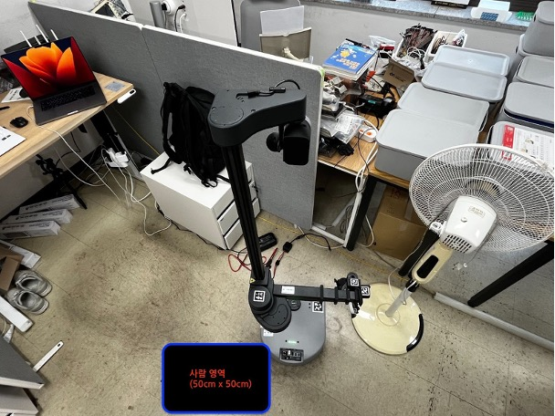

# 시각장애인 안내 로봇 시스템 설계 문서

## 1. 문제 정의

시각장애인은 실내 이동 시 시각 정보의 제한으로 인해  
공간 인지, 방향 판단, 장애물 회피에 어려움을 겪는다.

본 연구에서 해결하고자 하는 핵심 문제는 다음과 같다.

> **시각장애인이 실내 환경에서 외부 도움 없이도  
> 안전하게 목적지까지 이동할 수 있는 방법은 무엇인가**

자율주행 로봇 기술은 이미 일정 수준 이상의 성숙도를 보이고 있으나,  
대부분은 로봇 자체의 이동 성공에 초점이 맞춰져 있다.

시각장애인 안내 로봇은 단순한 자율주행을 넘어  
**사람 중심의 요구 사항**을 만족해야 한다.

### 사람 중심 안내 로봇의 요구
- 갑작스러운 회전 및 정지 최소화
- 로봇 행동에 대한 명확한 설명 제공
- 실패 상황에 대한 사용자 이해 가능성 확보

따라서 본 프로젝트는 **ROS Navigation을 기반으로 하되**,  
다음 두 가지를 핵심 주제로 설정한다.

- 음성 중심 안내 인터페이스
- 안내 상태에 따라 동작하는 상태 기반 로직

---

## 2. 요구사항 분석

### 2.1 목적지 자율 주행
- 사용자가 지정한 목적지까지 자율적으로 이동 가능해야 한다.

### 2.2 음성 및 물리 기반 인터페이스
- 음성 입력: 목적지 명칭 입력 및 최종 확인
- 음성 출력: 이동 상태(직진/회전), 장애물 상황, 도착 안내
- 물리 입력
  * (대기중) 시스템 활성화 및 목적지 입력 시작
  * (이동중) 즉시 감속 및 안내 중단(비상 정지)

### 2.3 상태 기반 로직 동작

#### 대기 상태 (Idle)
- 사용자 입력 대기
- 목적지 도착 후 자동 전환

#### 이동 상태 (Navigation)
- 목적지 입력 및 확인
- 안내 중 이동
- 버튼 입력 시 이동 중단
- 장애물 대응
- 45도 이상 회전 시 사전 안내
- 경로 재탐색

---

## 3. 사용자 시나리오

  
   
  <em>그림 1. 시각장애인 안내 로봇 사용자 위치</em>

사용자는 **A에서 B까지 이동**하는 상황을 가정한다.  
로봇은 **음성과 하나의 버튼 입력**을 통해 안내를 수행한다.

### 3.1 대기 상태
- 사용자 버튼 입력
- 로봇:  
  > "안녕하세요. 어디로 안내해 드릴까요?"

### 3.2 이동 상태 – 목적지 입력
- 사용자:  
  > "524호로 가주세요"
- 로봇:  
  > "524호로 안내해 드리겠습니다. 맞으신가요?"
- 사용자:  
  > "네"

### 3.3 이동 상태 – 안내 중 이동
- 로봇:  
  > "안내를 시작하겠습니다."  
  > "앞으로 직진합니다."  
  > "(45도 이상 회전 시)왼쪽으로 회전합니다."

### 3.4 이동 상태 – 장애물 대응
- 이동 중 장애물 감지
- 로봇:  
  > "앞에 장애물이 있어 잠시 멈춥니다."
  > (10초 경과) "아직 장애물이 남아있습니다. 잠시만 더 기다려 주세요"
  > (30초 경과) "장애물이 제거되지 않아 새로운 경로를 탐색합니다.

### 3.5 이동 상태 – 중단
- 사용자 버튼 입력
- 로봇:  
  > "안내를 종료합니다."
- 대기 상태로 전환

### 3.6 재안내
- 버튼 입력
- 로봇:  
  > "안녕하세요. 어디로 안내해 드릴까요?"

### 3.7 목적지 도착
- 로봇:  
  > "524호 앞에 도착했습니다."
- 대기 상태로 전환

---

## 4. 구현 계획

본 프로젝트는 ROS Navigation 기반 자율주행 위에  
시각장애인 안내를 위한 인터페이스를 추가하는 구조로 설계한다.

### 4.1 전체 시스템 구성
- 자율 이동: ROS Navigation
- 제어: 상태 기반 동작
- 사용자 인터페이스: 음성 및 버튼 입력

---

### 4.2 자율주행 및 위치 추정
- 로봇 위치 추정 및 경로 계획은 ROS Navigation 사용
- 실내 환경에 대한 사전 지도 생성
- 각 호실을 지도 위 목표 지점으로 설정
- 목적지 입력 시 해당 좌표로 이동

---

### 4.3 상태 기반 로직 구현

#### 4.3.1 대기 상태
- 사용자 입력 대기
- 버튼 입력 시 목적지 입력 단계로 전환
- 목적지 도착 시 자동 대기 상태 전환

#### 4.3.2 이동 상태
- 목적지 입력 및 확인
- 안내 중 이동
- 장애물 감지 시 일시 정지
- 일정 시간 내 장애물 미제거 시 경로 재탐색
- 이동 중 버튼 입력 시 이동 종료 후 대기 상태 전환

---

### 4.4 음성 인터페이스 구현

#### 4.4.1 음성 출력
- 안내 시작
- 직진 및 회전 안내
- 장애물 정지 안내
- 안내 종료
- 목적지 도착 안내

#### 4.4.2 음성 입력
- 목적지 입력 및 확인에만 음성 명령 사용

---

### 4.5 버튼 입력 처리
버튼은 하나만 사용하며 상태에 따라 동작이 달라진다.

- 대기 상태: 목적지 입력 시작
- 이동 상태: 안내 중단 및 이동 종료

---

### 4.6 구현 환경
- 개발 환경: ROS
- 프로그래밍 언어: Python

---

## 5. 시스템 역할 분담

- **로봇**
  - 하드웨어 주행 (이동, 회전, 정지)
  - LiDAR 기반 장애물 감지
  - Navigation 경로 수행
  - 컴퓨터 명령 이행

- **컴퓨터**
  - RViz를 통한 지도 및 위치 확인
  - 음성 인식 처리
  - ROS 토픽 publish
