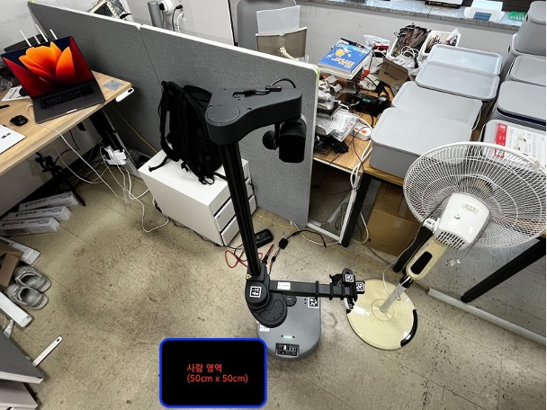

# 시각장애인 안내 로봇 시스템 설계 문서

## 1. 문제 정의

시각장애인은 실내 이동 시 시각 정보의 제한으로 인해  
공간 인지, 방향 판단, 장애물 회피에 어려움을 겪는다.

본 연구에서 해결하고자 하는 핵심 문제는 다음과 같다.

> **시각장애인이 실내 환경에서 외부 도움 없이도  
> 안전하게 목적지까지 이동할 수 있는 방법은 무엇인가**

자율주행 로봇 기술은 이미 일정 수준 이상의 성숙도를 보이고 있으나,  
대부분은 로봇 자체의 이동 성공에 초점이 맞춰져 있다.

시각장애인 안내 로봇은 단순한 자율주행을 넘어  
**사람 중심의 요구 사항**을 만족해야 한다.

### 사람 중심 안내 로봇의 요구
- 갑작스러운 회전 및 정지 최소화
- 로봇 행동에 대한 명확한 설명 제공
- 실패 상황에 대한 사용자 이해 가능성 확보

따라서 본 프로젝트는 **ROS Navigation을 기반으로 하되**,  
다음 두 가지를 핵심 주제로 설정한다.

- 음성 중심 안내 인터페이스
- 안내 상태에 따라 동작하는 상태 기반 로직

---

## 2. 요구사항 분석

### 2.1 목적지 자율 주행
- 사용자가 지정한 목적지까지 자율적으로 이동 가능해야 한다.

### 2.2 음성 및 물리 기반 인터페이스
- 음성 입력: 목적지 명칭 입력 및 최종 확인
- 음성 출력: 이동 상태(직진/회전), 장애물 상황, 도착 안내
- 물리 입력
  * (대기중) 시스템 활성화 및 목적지 입력 시작
  * (이동중) 즉시 감속 및 안내 중단(비상 정지)

### 2.3 상태 기반 로직 동작

시스템은 **4개의 상태**만 사용한다.

| 상태 | 설명 |
|------|------|
| **LOCKED** | 기본 대기 상태. 시스템 비활성 |
| **READY** | 안내 준비 상태. 목적지 입력 대기 |
| **NAV** | 자율 주행 중 |
| **PAUSED** | 주행 일시 정지 (재개·변경·종료 선택 가능) |

설계 원칙:
- **GPT는 의도 해석만 한다** — 상태 전이 결정은 코드가 담당
- **최종 상태 전이는 코드가 한다** — GPT 결과를 그대로 신뢰하지 않음
- **최종 확정은 항상 버튼이다** — 모든 중요 액션은 버튼으로 재확인

---

## 3. 사용자 시나리오

<p align="center">
  
  <br/>
  <em>그림 1. 시각장애인 안내 로봇 사용자 위치</em>
</p>

사용자는 **A에서 B까지 이동**하는 상황을 가정한다.  
로봇은 **음성과 하나의 버튼 입력**을 통해 안내를 수행한다.

### 3.1 LOCKED → READY (안내 시작)
- 사용자가 버튼을 1회 누름
- 로봇: > "안녕하세요. 어디로 안내해 드릴까요?"

### 3.2 READY → NAV (목적지 확정)
- 사용자: > "524호로 가주세요"
- GPT가 의도를 해석 → 로봇: > "524호로 안내해 드리겠습니다. 맞으면 버튼을 눌러 주세요"
- 사용자가 버튼을 누름 → NAV 전환
- *(timeout 시 LOCKED으로 복귀)*

### 3.3 NAV – 안내 중 이동
- 로봇: > "안내를 시작하겠습니다."
- 로봇: > "앞으로 직진합니다."
- 로봇: > "(45도 이상 회전 시) 왼쪽으로 회전합니다."

### 3.4 NAV – 장애물 대응
- 장애물 감지 시 자동 정지
- 로봇: > "앞에 장애물이 있어 잠시 멈춥니다."
- (10초 경과) > "아직 장애물이 남아있습니다. 잠시만 더 기다려 주세요."
- (30초 경과) > "장애물이 제거되지 않아 새로운 경로를 탐색합니다."

### 3.5 NAV → PAUSED (일시 정지)
- 사용자가 버튼을 누르거나 손잡이를 당김
- 로봇이 즉시 정지, PAUSED 상태로 전환
- 이후 세 가지 선택 가능:
  - **재개**: 버튼 → "다시 이동할까요? 맞으면 버튼을 눌러 주세요" → 버튼 → NAV
  - **목적지 변경**: 새 목적지 발화 → GPT 확인 → 버튼 → NAV
  - **목적지만 바꾸고 싶음**: 변경 의사 발화 → 확인 → 버튼 → READY
  - **종료**: 종료 의사 발화 → "안내를 종료할까요? 맞으면 버튼을 눌러 주세요" → 버튼 → LOCKED

### 3.6 NAV → LOCKED (목적지 도착)
- 로봇: > "524호 앞에 도착했습니다."
- 자동으로 LOCKED 상태로 전환

---

## 4. 구현 계획

본 프로젝트는 ROS Navigation 기반 자율주행 위에  
시각장애인 안내를 위한 인터페이스를 추가하는 구조로 설계한다.

### 4.1 전체 시스템 구성
- 자율 이동: ROS Navigation
- 제어: 상태 기반 동작
- 사용자 인터페이스: 음성 및 버튼 입력

---

### 4.2 자율주행 및 위치 추정
- 로봇 위치 추정 및 경로 계획은 ROS Navigation 사용
- 실내 환경에 대한 사전 지도 생성
- 각 호실을 지도 위 목표 지점으로 설정
- 목적지 입력 시 해당 좌표로 이동

---

### 4.3 상태 기반 로직 구현

#### 상태 전이 요약

```
LOCKED
  └─ 버튼 → READY

READY
  ├─ timeout → LOCKED
  └─ 목적지 발화 + GPT 확인 + 버튼 → NAV

NAV
  ├─ 도착 → LOCKED
  └─ 버튼 or 손잡이 당기기 → PAUSED

PAUSED
  ├─ 버튼 + 확인 버튼 → NAV  (재개)
  ├─ 새 목적지 발화 + 확인 버튼 → NAV  (목적지 변경)
  ├─ 변경 의사 발화 + 확인 버튼 → READY
  └─ 종료 의사 발화 + 확인 버튼 → LOCKED
```

#### 4.3.1 LOCKED
- 시스템 비활성 대기 상태
- 버튼 1회 입력 시 READY로 전환

#### 4.3.2 READY
- "어디로 안내해 드릴까요?" 안내 후 음성 입력 대기
- GPT가 발화에서 목적지 의도를 추출 → 확인 질문 → 버튼으로 최종 확정 후 NAV
- 일정 시간 내 입력 없으면 timeout → LOCKED

#### 4.3.3 NAV
- Nav2 액션으로 목적지 좌표까지 자율 주행
- 45도 이상 회전 시 사전 음성 안내
- 장애물 감지 시 정지 → 10초/30초 단계별 대응 및 경로 재탐색
- 버튼 또는 손잡이 당기기 신호 수신 시 즉시 PAUSED
- 목적지 도착 시 LOCKED

#### 4.3.4 PAUSED
- 주행 즉시 정지
- GPT로 사용자 발화 의도 분류: **재개 / 새 목적지 / 목적지 변경 의사 / 종료**
- 모든 전이는 버튼으로 최종 확정 (최종 확정은 항상 버튼이다)

---

### 4.4 음성 인터페이스 구현

인터페이스는 두 계층으로 분리된다.

| 계층 | 구성 요소 | 역할 |
|------|-----------|------|
| 음성 입출력 층 | `interface.py` (VoiceInterface) | 마이크 입력, TTS 출력, beep, 수음 게이트 제어 |
| 상태/주행 관리 층 | `main_state_machine.py` + `navigation_client.py` | 상태 전이, Nav2 연동 |

#### 4.4.1 음성 입력
- 마이크 입력 수신 및 수음 게이트 제어
- **READY**, **PAUSED** 상태에서만 활성화
- 목적지 입력 및 확인 발화 처리

#### 4.4.2 GPT 의도 해석
- GPT는 **의도 해석만** 담당하며 상태 전이를 직접 결정하지 않음
- 목적지 추출, 재개/변경/종료 의도 분류
- 결과를 바탕으로 확인 질문 생성

#### 4.4.3 음성 출력 (TTS + beep)
- 안내 시작 / 직진 및 회전 안내 / 장애물 정지 안내
- 목적지 도착 안내 / 안내 종료
- 상황에 따라 beep 음으로 간결한 피드백 제공

---

### 4.5 버튼 및 물리 입력 처리

버튼 하나와 손잡이 당기기 센서를 사용하며, 상태에 따라 동작이 달라진다.

| 상태 | 버튼 입력 | 손잡이 당기기 |
|------|-----------|---------------|
| LOCKED | READY로 전환 | — |
| READY | 확인(목적지 확정) | — |
| NAV | PAUSED로 전환 | PAUSED로 전환 |
| PAUSED | 재개/변경/종료 확정 | — |

> **핵심 원칙: 최종 확정은 항상 버튼이다**  
> GPT 확인 질문 이후 반드시 버튼 입력으로 전이를 확정한다.

---

### 4.6 구현 환경
- 개발 환경: ROS
- 프로그래밍 언어: Python

---

## 5. 시스템 역할 분담

- **로봇**
  - 하드웨어 주행 (이동, 회전, 정지)
  - LiDAR 기반 장애물 감지
  - Navigation 경로 수행
  - 컴퓨터 명령 이행

- **컴퓨터**
  - RViz를 통한 지도 및 위치 확인
  - 음성 인식 처리
  - ROS 토픽 publish
