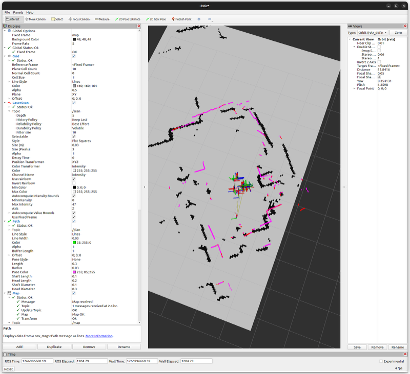
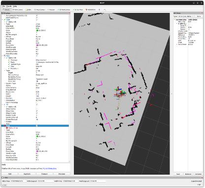
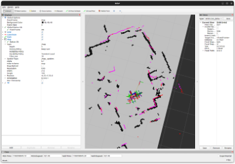
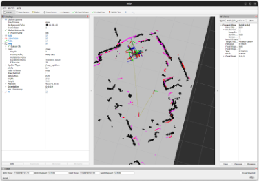

# Stretch 3 내비게이션 및 SLAM

## 1. 환경 및 워크스페이스 정보

- 로봇: Hello Robot Stretch 3  
- OS: Ubuntu 22.04  
- ROS: ROS2 Humble  
- 워크스페이스: `~/ament_ws`

### 네트워크 설정
로봇과 노트북 **모두 동일한 ROS Domain ID 설정 필요**
```bash
export ROS_DOMAIN_ID=0
````

### 주요 패키지

* `stretch_core`
* `stretch_nav2`
* `rplidar_ros`

### SSH 접속

```bash
ssh -Y hello-robot@192.168.0.89
ssh -Y hello-robot@172.20.10.3
```

* 비밀번호: `hello2020`
* 로봇 SSH: 실제 이동, 드라이버 실행
* 노트북: RViz, Python 노드 실행

---

## 2. 사전 점검 및 초기화 (로봇 SSH)

본체 전원을 켠 후 가장 먼저 수행한다.

1. 배터리 체크(11.0V 미만 시 충전)

```bash
stretch_robot_battery_check.py
```

2. 기존 프로세스 정리

```bash
stretch_free_robot_process.py
```

3. 로봇 원점 설정

```bash
stretch_robot_home.py
```

4. 시간 동기화

```bash
sudo date -s "$(ssh hello-robot@192.168.0.89 'date')"
sudo date -s "$(ssh hello-robot@172.20.10.3 'date')"
sudo date -s "2026-01-23 10:37:00"
```

5. 네트워크 동기화(두 기기 다)

```bash
export ROS_DOMAIN_ID=0
```
6. 팔 넣기
```bash
/home/hello-robot/.local/bin/stretch_robot_stow.py
```
---

## 3. 지도 생성하기 (실시간 SLAM)

### 3.1 로봇(SSH)에서 실행


1단계: Stretch 드라이버 실행

로봇의 하드웨어를 제어하고 오도메트리(바퀴 회전량) 데이터를 생성합니다.

```bash
ros2 launch stretch_core stretch_driver.launch.py mode:=navigation broadcast_odom_tf:=True
```

2단계: 내비게이션 모드 활성화
로봇이 주행할 수 있도록 전원을 연결하고 모드를 전환합니다.

```bash
ros2 service call /switch_to_navigation_mode std_srvs/srv/Trigger {}
```

3단계: LiDAR 실행
주변 장애물을 감지하는 레이저 스캐너를 켭니다.

```bash
ros2 run rplidar_ros rplidar_composition --ros-args \
-p serial_port:=/dev/hello-lrf \
-p serial_baudrate:=115200 \
-p frame_id:=laser
```

4단계: 정밀 SLAM 실행 (Slam Toolbox)
이전보다 더 촘촘하고 정확하게 지도를 그리는 설정입니다.

```bash
ros2 run slam_toolbox async_slam_toolbox_node --ros-args -p odom_frame:=odom -p base_frame:=base_link -p scan_topic:=/scan -p mode:=mapping -p use_sim_time:=false -p min_laser_range:=0.8 -p max_laser_range:=15.0 -p minimum_travel_distance:=0.1 -p minimum_travel_heading:=0.1 -p map_update_interval:=0.5 -p transform_timeout:=0.2
```

---

### 3.2 노트북(Local)에서 실행

1단계:  키보드 조종

```bash
ros2 run teleop_twist_keyboard teleop_twist_keyboard --ros-args -r /cmd_vel:=/stretch/cmd_vel
```
2단계:  RViz 실행

```bash
ros2 run rviz2 rviz2
```


## 4. 좌표 지정해서 알아서 움직이게 하기 (Navigation)

### 4.1 RViz 설정 및 초기 위치 지정

<p align="center">
  
  <br/>
  <em>그림 4-1. RViz 기본 설정 화면</em>
</p>

<p align="center">
  
  <br/>
  <em>그림 4-2. 위치 추정 및 센서 시각화</em>
</p>

#### 필수 RViz 설정

* Fixed Frame: `map` (안되면, odom 바꾸고 다시)
* Map: Reliability Policy 해제, Durability `Transient Local`
* LaserScan: `/scan`, Reliability `Best Effort`
* TF / RobotModel / Path 추가
* **2D Pose Estimate**로 실제 로봇 위치 지정

---

### 4.2 내비게이션 스택 실행 (로봇 SSH)

#### 1단계: 기본 노드 실행

주행모드 활성화
```bash
ros2 launch stretch_core stretch_driver.launch.py mode:=navigation broadcast_odom_tf:=True 
```
 laser 프레임 고정
```bash
ros2 run rplidar_ros rplidar_composition --ros-args -p serial_port:=/dev/hello-lrf -p serial_baudrate:=115200 -p frame_id:=laser
```

#### 2단계: Navigation + 지도 서버

경로 계획/제어기 가동(/stretch?cmd_vel로 /cmd_vel이 전달되도록 일치시켜줌)
```bash
ros2 launch stretch_nav2 navigation_launch.py use_sim_time:=False --ros-args -r /cmd_vel:=/stretch/cmd_vel
```


맵을
home/hello-robot/GitHub/visually-impaired-navigation-robot/src/blind_nav_system/maps/test1_map.yaml로 설정
```bash
ros2 run nav2_map_server map_server --ros-args \
-p yaml_filename:=/home/hello-robot/GitHub/visually-impaired-navigation-robot/src/blind_nav_system/maps/test1_map.yaml \
-p use_sim_time:=False  
```


맵 서버 실행 후 필수
```bash
ros2 lifecycle set /map_server configure 
```
```bash
ros2 lifecycle set /map_server activate
```

#### 3단계: AMCL 실행

위치 추정 알고리즘
```bash
ros2 run nav2_amcl amcl --ros-args -p use_sim_time:=False 
```
```bash
ros2 lifecycle set /amcl configure
```
```bash
ros2 lifecycle set /amcl activate
```

---

### 4.3 기준 좌표 확인 (AMCL Pose)

```bash
ros2 topic echo /amcl_pose --once
```

### 4.4 Rviz에서 지점 찾기 
```bash
ros2 topic echo /clicked_point
```
이거 하고 publish Point하기 


### 4.5 로봇 속도/회전/출발속도 늦추기(선택)
```bash
ros2 param set /controller_server FollowPath.max_vel_x 0.3
ros2 param set /controller_server FollowPath.max_vel_theta 0.35
ros2 param set /controller_server FollowPath.acc_lim_theta 0.5
```


#### A 지점

<p align="center">
  
  <br/>
  <em>그림 4-3. A 지점 좌표</em>
</p>

#### B 지점

<p align="center">
  
  <br/>
  <em>그림 4-4. B 지점 좌표</em>
</p>

---


### 로그 분석

#### 1. stretch_driver 실행 로그

```text
ros2 launch stretch_core stretch_driver.launch.py mode:=navigation broadcast_odom_tf:=True

Base bump event: 하단 베이스에 충격 감지 센서 작동
Wrist single tap: 손목에 두드림 감지
New collision pair event: 자가 충돌 위험
Dynamixel communication error: 모터와 통신이 잘 안 됨
````

---

#### 2. Navigation 실행 로그

```text
ros2 launch stretch_nav2 navigation_launch.py use_sim_time:=False

Begin navigating: 지정된 좌표로 자율주행 시작 (정상)
Message Filter dropping message: 센서 데이터(라이다)가 시간 차이로 인해 무시됨
Failed to make progress: 로봇이 물리적으로 움직이지 못해 목표 도달 실패
Aborting handle: 현재 주행 명령 강제 중단
Running backup: 장애물 회피를 위한 비상 후진 시도
Exceeded time allowance: 정해진 시간 내에 이동 실패
Reached the goal!: 목적지 도착 성공 (정상)
Goal succeeded: 전체 작업 완료 (정상)
```

---

#### 3. Map Server 실행 로그

```text
ros2 run nav2_map_server map_server --ros-args -p yaml_filename:=...

Waiting on external lifecycle transitions: 노드가 켜졌고, 활성화 명령을 기다림
resolution / origin / mode: 지도의 해상도, 원점 좌표, 표현 방식설정값 확인
Loading image_file / Read map: 실제 지도 이미지(.pgm)를 메모리에 로드 완료
Activating: 지도를 다른 노드들이 볼 수 있도록 발행 시작 (정상)
Creating bond: 관리자 노드(Lifecycle Manager)와 연결 유지
```

---

#### 4. AMCL 실행 로그

```text
ros2 run nav2_amcl amcl --ros-args -p use_sim_time:=False
Couldn't determine robot's pose: 라이다 데이터와 지도가 맞지 위치 찾지 못함
Message Filter dropping message: 센서 데이터가 늦게 도착해 버려짐
consecutive laser scan transforms failed: 라이다와 로봇 사이의 좌표 계산 실패
Lookup would require extrapolation into the future: 데이터 전송 지연
```
---

## 5. 배터리 관리 및 충전

* 24V 이하 → 충전 필요 ⚡️
* LED 🟡 노란색(2초 주기) → 저전압 경고

### 충전기: NOCO Genius10

#### 기본 충전 (12V AGM)

1. 로봇 전원 OFF
2. 충전기 연결
3. MODE → 12V AGM
4. LED 상태 확인

#### SUPPLY 모드

* 전원 공급용
* 장시간 사용 시 발열 주의

#### REPAIR 모드

* 배터리 복구용
* Hello Robot 안내 없이 사용 금지

### 충전 시간

| 상태           | 예상 시간  |
| ------------ | ------ |
| 완전 방전 → 100% | 6~8시간  |
| 절반 이하 → 100% | 3~4시간  |
| 유지 충전        | 무제한 가능 |

---

## 6. 로봇 전원 관리

### 종료 절차

```bash
cd ~/ament_ws/src/stretch_web_teleop
./stop_interface.sh
pkill -f ros2
sudo shutdown now
```

→ 팬 정지 후 전원 버튼 OFF

### 전원 켜기

1. 본체 전원 버튼 ON
2. SSH 접속
3. 웹 인터페이스 실행

```bash
cd ~/ament_ws/src/stretch_web_teleop
./start_interface.sh
```