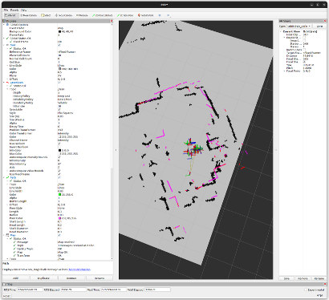
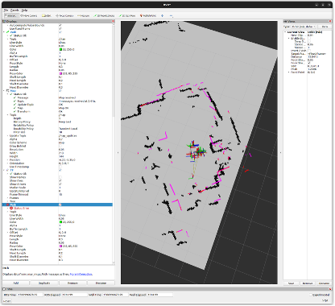
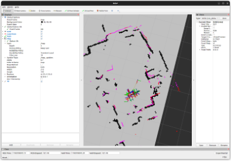
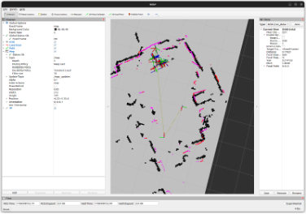

# Stretch 3 내비게이션 및 SLAM

## 1. 환경 및 워크스페이스 정보

- 로봇: Hello Robot Stretch 3  
- OS: Ubuntu 22.04  
- ROS: ROS2 Humble  
- 워크스페이스: `~/ament_ws`

### 네트워크 설정
로봇과 노트북 **모두 동일한 ROS Domain ID 설정 필요**
```bash
export ROS_DOMAIN_ID=0
````

### SSH 접속

```bash
ssh -Y hello-robot@192.168.0.89
ssh -Y hello-robot@172.20.10.3
```

* 비밀번호: `hello2020`
* 로봇 SSH: 실제 이동, 드라이버 실행
* 노트북: RViz, Python 노드 실행

---

## 2. 사전 점검 및 초기화 (로봇 SSH)

본체 전원을 켠 후 가장 먼저 수행한다.

1. 배터리 체크(11.0V 미만 시 충전)

```bash
stretch_robot_battery_check.py
```

2. 기존 프로세스 정리

```bash
stretch_free_robot_process.py
```

3. 로봇 원점 설정

```bash
stretch_robot_home.py
```

4. 네트워크 동기화(두 기기 다)

```bash
export ROS_DOMAIN_ID=0
```
5. 팔 넣기
```bash
/home/hello-robot/.local/bin/stretch_robot_stow.py
```
---

## 3. 지도 생성하기 (실시간 SLAM)

### 3.1 로봇(SSH)에서 실행


1단계: Stretch 드라이버 실행

로봇의 하드웨어를 제어하고 오도메트리(바퀴 회전량) 데이터를 생성합니다.

```bash
ros2 launch stretch_core stretch_driver.launch.py mode:=navigation broadcast_odom_tf:=True
```

2단계: 내비게이션 모드 활성화
로봇이 주행할 수 있도록 전원을 연결하고 모드를 전환합니다.

```bash
ros2 service call /switch_to_navigation_mode std_srvs/srv/Trigger {}
```

3단계: LiDAR 실행
주변 장애물을 감지하는 레이저 스캐너를 켭니다.

```bash
ros2 run rplidar_ros rplidar_composition --ros-args \
-p serial_port:=/dev/hello-lrf \
-p serial_baudrate:=115200 \
-p frame_id:=laser
```

4단계: 정밀 SLAM 실행 (Slam Toolbox)
이전보다 더 촘촘하고 정확하게 지도를 그리는 설정입니다.

```bash
ros2 run slam_toolbox async_slam_toolbox_node --ros-args -p odom_frame:=odom -p base_frame:=base_link -p scan_topic:=/scan -p mode:=mapping -p use_sim_time:=false -p min_laser_range:=0.8 -p max_laser_range:=15.0 -p minimum_travel_distance:=0.1 -p minimum_travel_heading:=0.1 -p map_update_interval:=0.5 -p transform_timeout:=0.2
```

---

### 3.2 노트북(Local)에서 실행

1단계:  키보드 조종

```bash
ros2 run teleop_twist_keyboard teleop_twist_keyboard --ros-args -r /cmd_vel:=/stretch/cmd_vel
```
2단계:  RViz 실행

```bash
ros2 run rviz2 rviz2
```


## 4. 좌표 지정해서 알아서 움직이게 하기 (Navigation)

### 4.1 RViz 설정 및 초기 위치 지정

<p align="center">
  
  <br/>
  <em>그림 4-1. RViz 기본 설정 화면</em>
</p>

<p align="center">
  
  <br/>
  <em>그림 4-2. 위치 추정 및 센서 시각화</em>
</p>

#### 필수 RViz 설정

* Fixed Frame: `map` (안되면, odom 바꾸고 다시)
* Map: Reliability Policy 해제, Durability `Transient Local`
* LaserScan: `/scan`, Reliability `Best Effort`
* TF / RobotModel / Path 추가
* **2D Pose Estimate**로 실제 로봇 위치 지정

---

### 4.2 내비게이션 스택 실행 (로봇 SSH)

#### 0단계(옵션): URDF를 수정한 상태에서 빌드(로봇에서 수행)
```bash
cd ~/ament_ws
colcon build --packages-select stretch_description --allow-overriding stretch_description
source install/setup.bash
```

#### 1단계: 기본 노드 실행

주행모드 활성화
```bash
ros2 launch stretch_core stretch_driver.launch.py mode:=navigation broadcast_odom_tf:=True 
```
 laser 프레임 고정
```bash
ros2 run rplidar_ros rplidar_composition --ros-args -p serial_port:=/dev/hello-lrf -p serial_baudrate:=115200 -p frame_id:=laser
```

안전구역 활성화
```bash
ros2 run tf2_ros static_transform_publisher --x -0.72 --y 0.72 --z 0.1 --yaw 0 --pitch 0 --roll 0 --frame-id base_link --child-frame-id safety_zone_left_back
```


#### 2단계: Navigation + 지도 서버

경로 계획/제어기 가동(nav2_params.yaml을 사용해서 크기 부풀리기 )

파라미터 설명
```text
# 로봇 크기 35cm x 35cm , 사람 공간 좌측 후방에 40cm x 40cm확보

footprint: "[ [0.175, -0.175], [0.175, 0.175], [-0.175, 0.575], [-0.575, 0.575], [-0.575, 0.175], [-0.175, -0.175] ]"

inflaction_radius: 0.4 (로봇 중앙을 기준으로 장애물은 40cm까지 허용)
cost_scaling_factor: 5.0 (장애물 근처의 위험비용 설정)
크기 설정으로 lidar에 감지된 영역은 절대 침범 안함
```

```bash
ros2 launch stretch_nav2 navigation_launch.py \
use_sim_time:=False \
params_file:=/home/hello-robot/ament_ws/src/stretch_ros2/stretch_nav2/config/nav2_params.yaml
```


맵을
home/hello-robot/GitHub/visually-impaired-navigation-robot/src/blind_nav_system/maps/test1_map.yaml로 설정
```bash
ros2 run nav2_map_server map_server --ros-args \
-p yaml_filename:=/home/hello-robot/GitHub/visually-impaired-navigation-robot/src/blind_nav_system/maps/test1_map.yaml \
-p use_sim_time:=False  
```


맵 서버 실행 후 필수
```bash
ros2 lifecycle set /map_server configure 
ros2 lifecycle set /map_server activate
```

#### 3단계: AMCL 실행

위치 추정 알고리즘
```bash
ros2 run nav2_amcl amcl --ros-args -p use_sim_time:=False 
```
```bash
ros2 lifecycle set /amcl configure
ros2 lifecycle set /amcl activate
```


# 런치파일 실행(4.2 모든 과정 포함, 여기서 nav2_params.yaml 파일 설정은 런치파일 내에서 수정해야함)
```bash
ros2 launch /home/hello-robot/GitHub/visually-impaired-navigation-robot/src/blind_nav_system/blind_nav_system/launch/stretch_robot_process.launch.xml
```


### 4.3 Rviz에서 지점 찾기 
```bash
ros2 topic echo /clicked_point
```
이거 하고 publish Point하기 


### 4.4 로봇 속도/회전/출발속도 늦추기(선택)
```bash
ros2 param set /controller_server FollowPath.max_vel_x 0.3
ros2 param set /controller_server FollowPath.max_vel_theta 0.35
ros2 param set /controller_server FollowPath.acc_lim_theta 0.5
```


#### A 지점

<p align="center">
  
  <br/>
  <em>그림 4-3. A 지점 좌표</em>
</p>

#### B 지점

<p align="center">
  
  <br/>
  <em>그림 4-4. B 지점 좌표</em>
</p>

---


# src/blind_nav_system/blind_nav_system 기능들
### hardware
signal_to_python폴더: 아두이노관련
input_bridge.py: 아두이노 신호 main_state_machine.py로 보내기

### main_state_machine.py
config내 location.yaml파일의 좌표를 통해 상태 변화 등 진행


일시정지
# Nav2 네비 스택 일시정지
ros2 service call /lifecycle_manager_navigation/manage_nodes nav2_msgs/srv/ManageLifecycleNodes "{command: 1}"

# 안전: 0속도 2초 (관성/잔류속도 제거)
timeout 2s ros2 topic pub -r 10 /stretch/cmd_vel geometry_msgs/msg/Twist \
"{linear: {x: 0.0, y: 0.0, z: 0.0}, angular: {x: 0.0, y: 0.0, z: 0.0}}"


## 5. 배터리 관리 및 충전

* 24V 이하 → 충전 필요 ⚡️
* LED 🟡 노란색(2초 주기) → 저전압 경고

### 충전기: NOCO Genius10

#### 기본 충전 (12V AGM)

#### SUPPLY 모드

* 전원 공급용
* 장시간 사용 시 발열 주의

#### REPAIR 모드

* 배터리 복구용
* Hello Robot 안내 없이 사용 금지


로봇 크기: 35cm x 35cm (중앙 기준)

사람 공간: 로봇의 좌측 후방에 40cm x 40cm 공간 확보

inflation_radius: 0.4m (40cm)

사람 쪽(왼쪽)은 풋프린트가 60cm 튀어나와 있어, 인플레이션(40cm)보다 먼저 벽을 감지하고 멈춥니다. (안전 우선)

로봇 쪽(오른쪽)은 풋프린트가 작으므로, 벽에서 40cm 이내로 진입하여 주행하는 것을 허용합니다. (주행성 우선)

cost_scaling_factor: 5.0

장애물 근처의 위험 비용을 완만하게 설정하여, 로봇이 좁은 틈새를 지나갈 때 너무 겁먹지 않도록 조정했습니다.